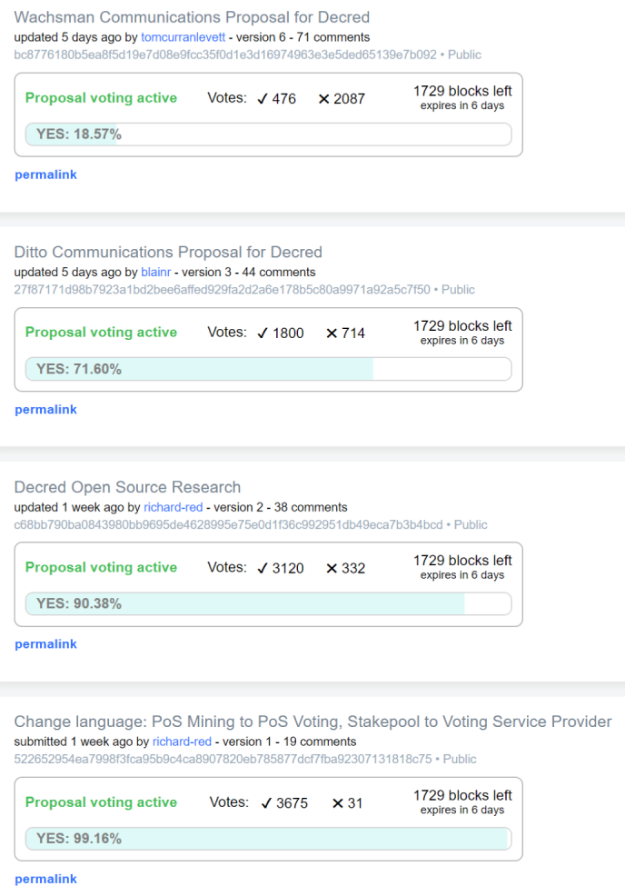
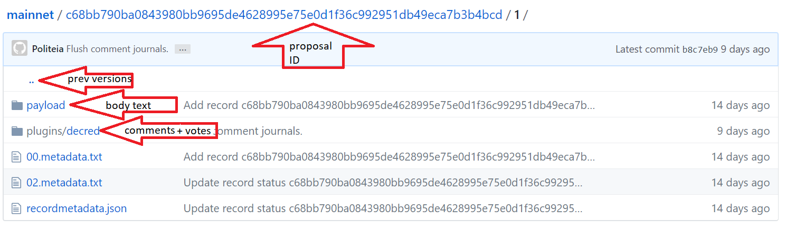

## Politeia Digest #2 - Oct 23-30th 2018

There were **no new proposals** submitted this week.

Over the past week, four proposals were authorized to start voting by their authors. The admins waited until an upgrade had been deployed, then opened voting for all of these proposals simultaneously on Oct 29th.

jy-p [confirmed](https://matrix.to/#/!MIGqWXfLFBwhipPKYL:decred.org/$15408340182830ummFF:decred.org) that there is a **quorum requirement of 20%** tickets voting Yes/No in order for Politeia votes to be valid. **For a proposal to pass it must achieve 60% Yes votes**.

### Proposals open for voting

**[Decred Open Source Research](https://proposals.decred.org/proposals/c68bb790ba0843980bb9695de4628995e75e0d1f36c992951db49eca7b3b4bcd) - submitted Oct 16 by richard-red - voting opened Oct 29 - 38 comments (+11)**

This proposal has not been revised in the last week, new comments include a variety of ideas for research and theories about how research could help steer various aspects of the Decred project.

**[Change language: PoS Mining to PoS Voting, Stakepool to Voting Service Provider](https://proposals.decred.org/proposals/522652954ea7998f3fca95b9c4ca8907820eb785877dcf7fba92307131818c75) - submitted Oct 19 by richard-red - voting opened Oct 29  - 19 comments  (+0)**

There have been no additional comments this week.

**[Wachsman Communications Proposal for Decred](https://proposals.decred.org/proposals/bc8776180b5ea8f5d19e7d08e9fcc35f0d1e3d16974963e3e5ded65139e7b092) - submitted Oct 19 by tomcurranlevett - voting opened Oct 29 - 71 comments (+33)**

This proposal was updated five times, with the most recent update made on Oct 25th. Significant edits include a reduction in the out-clause period from 90 days to 30, and a clarification that Wachsman would accept payments 100% in DCR (equivalent to $20k/month). Other edits added updated lists of press coverage and a list of satisfied clients. tomcurrenlevett [joined](https://matrix.to/#/!MIGqWXfLFBwhipPKYL:decred.org/$154043111539249iVAnl:decred.org) the #proposals channel on slack (as @tcl) and engaged in some real-time discussion with the community - subjects included the team that would staff the Decred account and potential conflict of interest with other clients.

**[Ditto Communications Proposal for Decred](https://proposals.decred.org/proposals/27f87171d98b7923a1bd2bee6affed929fa2d2a6e178b5c80a9971a92a5c7f50) - submitted Oct 22 by blainr - voting opened Oct 29 - 44 comments (+27)**

This proposal was updated twice, with the most recent update made on Oct 24th. These edits included a reduction in the out-clause period from 90 days to 30, a change to payment terms from $20k in USD and $10k equivalent in DCR to $30k in DCR, subsequently dropped to $25k in DCR. @liz from Ditto [joined](https://matrix.to/#/!MIGqWXfLFBwhipPKYL:decred.org/$154044500839351wDVHK:decred.org) the #proposals channel on Slack around 4 hours after tomcurrenlevett, and also engaged in some real-time discussion with the community - subjects included differentiation from Wachsman and whether/why Ditto's service is worth $5k/month more. Of note, @liz clarified (later added as a comment on the proposal by blainr) that the monthly fee could be reduced if Decred opted not to take some of the services that Ditto were offering. 

### General Politeia Discussions

Most of the discussion about specific proposals in the [#Proposals channel](https://matrix.to/#/!MIGqWXfLFBwhipPKYL:decred.org) this week concerned the Wachsman and Ditto proposals. These were also discussed on a [reddit post](https://www.reddit.com/r/decred/comments/9rpze2/wachsman_or_ditto_which_proposal_will_you_vote_for/) created by lehaon on Oct 27th, which has had 33 comments so far.

In addition to discussing the pros and cons of approving 0/1/2 of these proposals, there was some in-depth discussion about how to avoid accidentally approving both proposals (first raised [here](https://matrix.to/#/!MIGqWXfLFBwhipPKYL:decred.org/$154025591736228hcdGx:decred.org), followed up [here](https://matrix.to/#/!MIGqWXfLFBwhipPKYL:decred.org/$154038518738079RYsLo:decred.org) and [here](https://matrix.to/#/!MIGqWXfLFBwhipPKYL:decred.org/$154040027938510csCOJ:decred.org)). In the short-term, it was decided that voting on the two PR proposals should be initiated simultaneously - as long as the majority of stake-voters vote No for at least one proposal there should be no issue with approving both. Longer-term, the idea of a Request for Proposals (RFP) seemed to have support - whereby an initial proposal establishes that the Treasury should fund something in principle, with subsequent phases where proposals from competing parties are invited and then stakeholders vote to select the best one.

**@decredproject tweeting policy**: The subject of how the @decredproject twitter account should cover proposals was discussed by the contributors who staff it (in a private channel used for discussing the account's operation). In the interests of neutrality, it was decided that the @decredproject account should not tweet about proposals directly, but should re-tweet any reasonable tweet about a proposal by the proposal's author. If the proposal's author does not wish to tweet about it, tweets from others about the proposal should be considered for a re-tweet.

### Politeia software updates

Politeia is under active development, and will be for the foreseeable future. To see what people are working on or contribute to the discussions about how to develop the platform, check out the issues pages on the [politeia](https://github.com/decred/politeia/issues) and [politeiagui](https://github.com/decred/politeiagui/issues/) repositories.

The proposals site was updated this week to add buttons linking to the underlying data for proposals on GitHub ([example](https://github.com/decred-proposals/mainnet/tree/master/c68bb790ba0843980bb9695de4628995e75e0d1f36c992951db49eca7b3b4bcd/1)). Those links take you to the latest version of the proposal, within the payload folder there is an index.md file with the body text of that version of the proposal. Within the plugins/decred/ folder there are records of all the comments and up/down votes on proposals.decred.org (comments.journal), and all of the ticket votes (ballot.journal - if voting is open).

You can also navigate up one level to browse all of the previous versions of the proposal, within their respective payload directories. Interface for browsing proposal versions and diffs on proposals.decred.org is coming soon.

## About this issue

Content for this edition was authored by richard-red, with language tweaks by oregonisaac

Also available on [reddit](https://www.reddit.com/r/decred/comments/9qnye8/politeia_digest_issue_1_a_short_weekly_update_on/) and [medium](https://medium.com/@richardred/politeia-digest-issue-2-d3579bb2ea7c).

If you have thoughts on how this format could be developed or would like to contribute, join the [Writers channel](https://matrix.to/#/!lbzTjhzNbIaDbuAxkS:decred.org) and let us know.