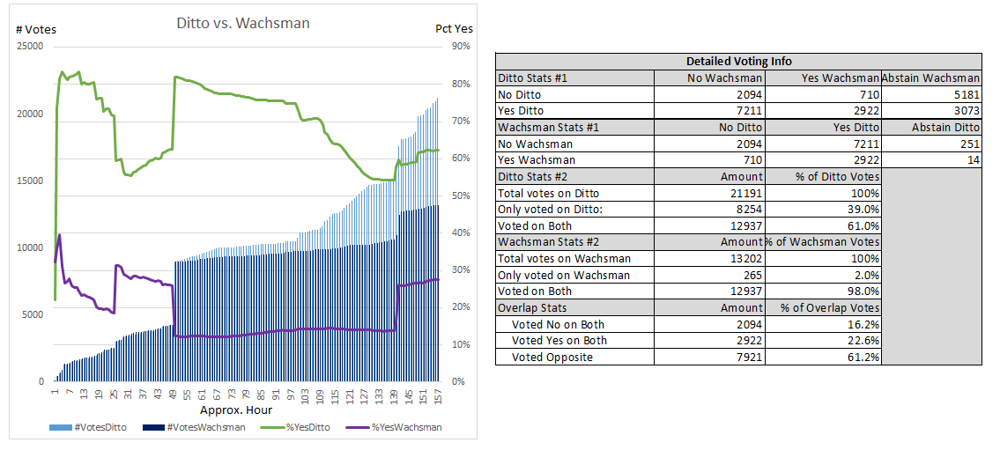

## Politeia Digest #3 - Oct 31st-Nov 6th 2018

### New Proposals

**[Premium Listing for Decred on Easyrabbit ](https://proposals.decred.org/proposals/34707d34b09c3ebcf0d4aa604e8a08244e8f0f082c0af3f33d85778c93c81434) - submitted Oct 30th by easyrabbit - 11 comments**

Easyrabbit has already listed DCR and is offering a "premium listing" for 30DCR - with promotions like no/low trading fees and feature placement on the site and in social media. Comments point out that Decred has never paid for an exchange listing and generally express scepticism about this offer.

**[Sweepstakes](https://proposals.decred.org/proposals/517ac6598031e17e3e301d41e73a62e4a7c10ee6dafb3dc65fbdd32f550971b0) - submitted Nov 5th by geraldoneto - 8 comments**

This proposal describes a raffle system and some example configurations, but does not propose a specific plan for building it. Comments criticise the proposal for lack of detail, and express doubt that building such a system is worthwhile.

### Approved proposals

The votes that concluded this week all had the same start block. The ticket pool held 41,102 tickets when the ticket snapshot for these proposals was taken (block [286972](https://explorer.dcrdata.org/block/286972)), so the quorum requirement (20%) was 8,220 votes.

**[Decred Open Source Research](https://proposals.decred.org/proposals/c68bb790ba0843980bb9695de4628995e75e0d1f36c992951db49eca7b3b4bcd) - voting closed Nov 5 - 40 comments (+2)**

11,854 Yes votes, 1,287 No votes (90.2% Yes) - voter participation of 32%, support from 28.8% of tickets.

#Research channels have been created on [Matrix](https://matrix.to/#/!vGasNHFXqjoEWUBTIi:decred.org) and Slack platforms and they have been bridged. Discussions of how to get this program up and running have started. Another Politeia proposal for collecting and discussing research questions and methods will be submitted soon.

**[Change language: PoS Mining to PoS Voting, Stakepool to Voting Service Provider](https://proposals.decred.org/proposals/522652954ea7998f3fca95b9c4ca8907820eb785877dcf7fba92307131818c75) - voting closed Nov 5  - 19 comments  (+0)**

11,991 Yes votes, 754 No votes (94.1% Yes) - voter participation of 31%, support from 29.2% of tickets.

Next step: The [pull request](https://github.com/decred/dcrdocs/pull/590) to make this change on the docs site will be rebased and merged around Nov 12.

**[Ditto Communications Proposal for Decred](https://proposals.decred.org/proposals/27f87171d98b7923a1bd2bee6affed929fa2d2a6e178b5c80a9971a92a5c7f50) - voting closed Nov 5 -  47 comments (+3)**

13,206 Yes votes, 7985 No votes (62.3% Yes) - voter participation of 51.6%, support from 32.1% of tickets.

Next step: @dustorf will have a meeting with Ditto representatives to kick things off and report back about how Ditto will communicate with the project and community going forward.

### Rejected proposals

**[Wachsman Communications Proposal for Decred](https://proposals.decred.org/proposals/bc8776180b5ea8f5d19e7d08e9fcc35f0d1e3d16974963e3e5ded65139e7b092) - voting closed Nov 5 - 73 comments (+2)**

3,646 Yes votes, 9,556 No votes (27.6% Yes) - voter participation of 32.1%, support from 8.9% of tickets.

### Politeia Discussions

Much of the discussion in the #Proposals channel this week has been about the ongoing votes. After a few days, the Ditto proposal became the most closely watched, as it bounced above and below the critical 60% threshold.

The details of how Politeia stores data have been discussed. There are no timestamps recorded in the repository for individual ticket votes, but these are journaled and added in hourly commits, so it is possible to know which hour a ticket voted in based on this data. The lack of timestamps in the data is a measure to protect the privacy of people who vote with large blocks of tickets at once without using the vote trickling options CLI offers. 

@snr01 produced charts from the ticket voting data showing number of Yes and No votes per commit (hour) for the Ditto and Wachsman proposals. The final version is included below.

The chart indicates that there were short intervals where significant blocks of tickets voted, typically for one proposal and against another. 

Analysis of the tickets indicates that almost every ticket that votes on the Wachsman proposal also voted on the Ditto proposal (98%), whereas 39% of the tickets that voted on Ditto did not vote on Wachsman. 

Of the 12,937 tickets that voted on both proposals, 61.2% voted for one and against the other, 22.6% voted Yes on both, and 16.2% votes No on both.

### Documentation for Politeia data

A [pull request](https://github.com/decred/dcrdocs/pull/679) is open to add a page about navigating Politeia data to the docs site. 