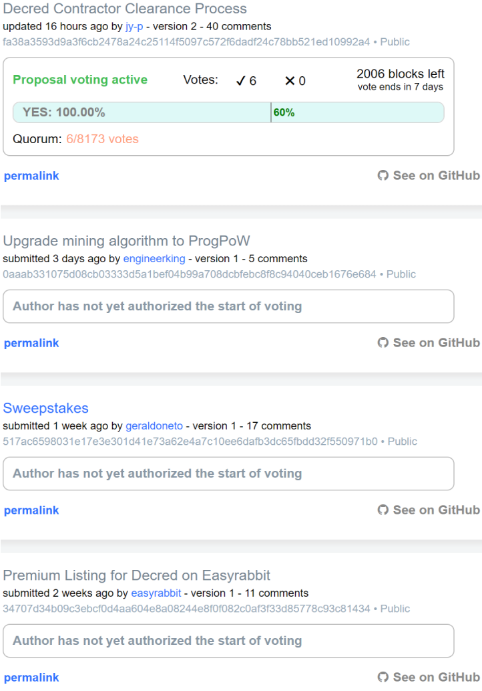

## Politeia Digest #4 - Nov 7th-Nov 13th 2018

### Proposal open for voting

**[Decred Contractor Clearance Process](https://proposals.decred.org/proposals/fa38a3593d9a3f6cb2478a24c25114f5097c572f6dadf24c78bb521ed10992a4) - updated Nov 13th by jy-p, voting started Nov 14th - 40 comments (+2)**

This proposal was updated to a second version and the start of voting was authorized late on Nov 13th,  @jy-p commented:  "I have updated this proposal with input from commenters, added bonuses for milestones, and added a list of initial contractors that can reasonably drive this work to completion."

Voting opened on Nov 14th at 14:21.

*Recap: This proposal is about formalizing Decred's process for approving new contributors to be paid for their work. A Decred Contractor Clearance (DCC) would be required for every person whose work is being charged to the Treasury. The process of granting and revoking DCCs requires the agreement of at least 3 established contributors in the relevant subdomain. Mechanisms for escalating issues to an all-contractor vote, and ultimately a stakeholder vote, were also described.*

### New Proposals

**[Upgrade mining algorithm to ProgPoW](https://proposals.decred.org/proposals/0aaab331075d08cb03333d5a1bef04b99a708dcbfebc8f8c94040ceb1676e684) - submitted Nov 11th by engineerking - 4 comments**

This proposal suggests that Decred adopts ProgPoW and espouses ASIC-resistance. Comments point out that this proposal is more like a shower thought than the kind of well described plan which would warrant serious discussion and voting by the community.

### Proposals under discussion

**[Sweepstakes](https://proposals.decred.org/proposals/517ac6598031e17e3e301d41e73a62e4a7c10ee6dafb3dc65fbdd32f550971b0) - submitted Nov 5th by geraldoneto - 17 comments (+9)** 

So far the proposal owner has not responded to comments on the proposal. New comments this week express no support for the proposal, questioning both the rationale for Decred to do something like this and the practicalities of making it happen.

### Politeia Discussions and Development

The proposals.decred.org GUI has been updated to show the quorum and approval requirements on each proposal that has opened voting.

The subject of **sub-standard proposals** and the extent to which they clutter the proposals site has been discussed in some depth this week. 

There are a couple of issues with these: 

1. If the proposal owner does not authorize the start of voting, they occupy space on Politeia tabs like [pre-voting] and [all proposals] for an extended period of time.
2. The cycle for a proposal submission and vote is quite long, and so every proposal will occupy a significant amount of voter attention by virtue of appearing in high-visibility locations for ~2-3 weeks and requiring votes to determine the outcome.

The visibility afforded to each proposal, and low cost to submit a proposal, could lead to more proposals with the primary aim of promoting their subject and only secondary consideration given to whether it is an appropriate decision to run past all of Decred's stakeholders.

The first is an immediate problem with relatively straightforward solutions. There are issues discussing two approaches: [allow admins to force the start of a vote after N days](https://github.com/decred/politeia/issues/590), and [timeout and deprecate untouched proposals](https://github.com/decred/politeia/issues/479), where proposals that remain inactive for some time can be deprecated by given a deprecated status by admins and would disappear from the lists where proposals are displayed.

The second is a potential problem and not yet pressing with a total of 9 proposals. There was a discussion/ideation session in #governance (spilling into other channels) that has some perspectives worth sharing here.

* @jy-p [observed](https://matrix.to/#/!MIGqWXfLFBwhipPKYL:decred.org/$154204492114009oiNPG:decred.org) that so far every proposal has been approved by admins, to give a sense of what the standard of incoming proposals is like. When votes start happening for the lower-quality proposals, the outcomes may help to establish that the stakeholders are not interested in certain kinds of proposal. Moderation by admins and raising the proposal fee are two levers that can still be pulled to reduce the effects of spam.
* @davecgh [suggested](https://matrix.to/#/!MIGqWXfLFBwhipPKYL:decred.org/$154204810014110MwJWj:decred.org) a mechanism for (a large) part of the proposal fee to be used as a deposit, returned to the proposer if the proposal meets some minimum threshold of approval. This would encourage prospective proposers to think about their prospects of success and maybe run their idea past the community before taking the step of submitting a proposal.
* @richard-red [suggested](https://matrix.to/#/!tIDEIWechmqCLjPiui:decred.org/$154169451411949qmiwp:decred.org) a quick initial period of voting to after which proposals with very low approval (e.g. <10%) would be hidden or rejected. Also, [separately](https://matrix.to/#/!MIGqWXfLFBwhipPKYL:decred.org/$154204564214033cNANd:decred.org), a junk classification that admins could assign to proposals, possibly after seeing the discussion, to remove them to a special junk tab where they would be visible and could be discussed but wouldn't get in the way.
* @bee [suggested](https://matrix.to/#/!tIDEIWechmqCLjPiui:decred.org/$154181581112782cpoIY:decred.org) open "sentiment voting" as soon as proposals are visible, which is non-binding but can give a signal about whether the proposal has a chance in a real vote, with these sentiment votes being disregarded if the proposal goes to a proper vote. Another idea was to introduce a separate space for smaller and low-quality proposals, along with ways how the proposals could move between the two spaces.
* Developing better proposal guidelines and forcing proposals to provide answers to certain key questions were also discussed, with the idea being to give the admins a stronger remit to censor proposals that do not meet the required standard.

Discussion of [blind voting](https://matrix.to/#/!tIDEIWechmqCLjPiui:decred.org/$154168358611832HVrEj:decred.org) in #governance, evolves into a discussion of low-quality proposals. 

Discussion of [proposal updates](https://matrix.to/#/!MgQoetFiyjrHAywokv:decred.org/$154194006413164sAmLf:decred.org) in #general and on this [issue](https://github.com/decred/politeia/issues/591). The question of whether Politeia should facilitate the communication of updates on funded proposal was discussed. Arguments in favor of using Politeia for this are that it can benefit from the permanent censorship-resistant record-keeping of Pi, and should also benefit from the notifications feature.

Arguments were made against mandatory reporting, which everyone seems to agree is not desirable. Suggestions were put forward to 1) allow proposal owners to make comments on their funded proposals (all commenting is currently locked on proposals that have finished voting) and allow comments in reply to that thread only, 2) use a modified type of "proposal" which would not appear in the usual places and would not be voted on, but would be shown in an Updates tab and linked to from the page for its relevant parent proposal. 

A [pull request](https://github.com/decred/dcrdocs/pull/679) to add a page about navigating Politeia data to dcrdocs has just been merged (this [link](/advanced/navigating-politeia-data/) will work once it is deployed). The next issue should include some analysis of this data.

## About this issue

Content for this edition was authored by @richard-red with contributions from @bee

Also available on [medium](https://medium.com/politeia-digest/politeia-digest-issue-4-nov-7-nov-13-2018-685e18e7491a).

If you have thoughts on how this format could be developed or would like to contribute, join the [Writers channel](https://matrix.to/#/!lbzTjhzNbIaDbuAxkS:decred.org) and let us know.
