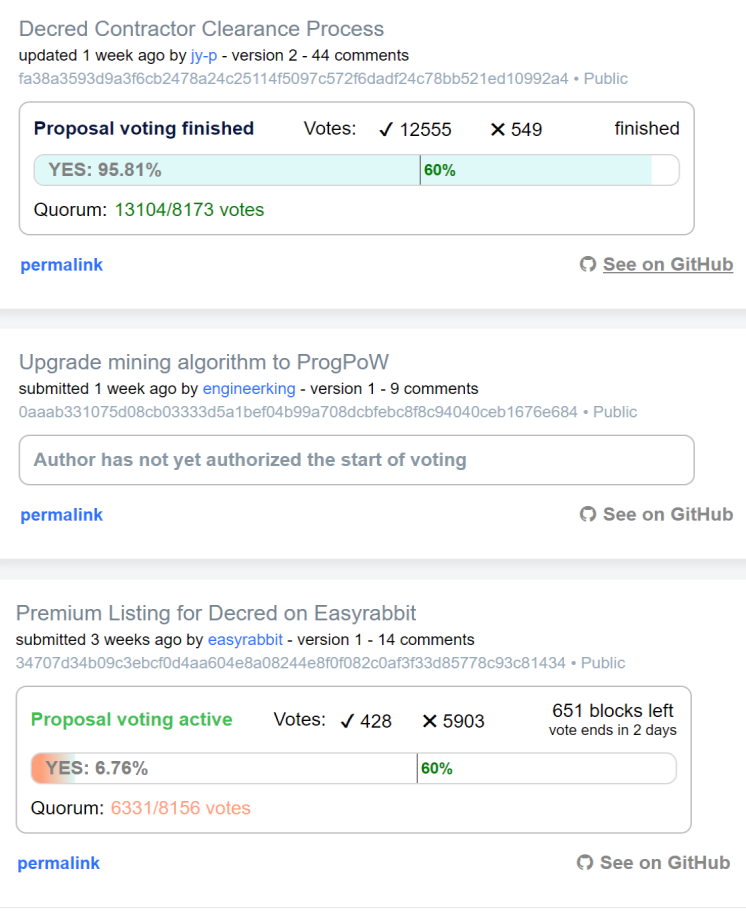
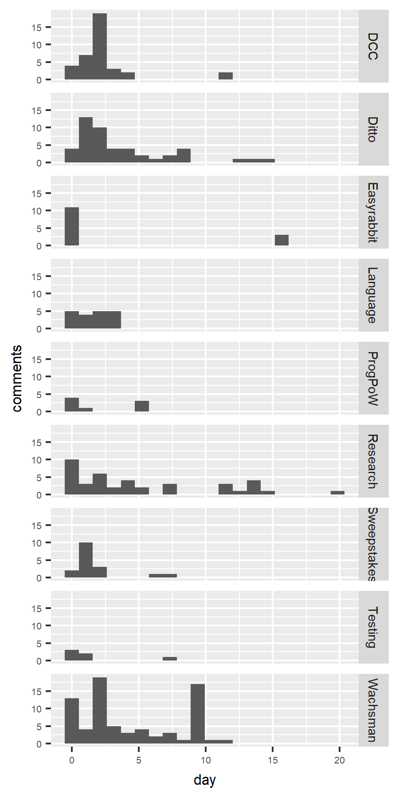

## Politeia Digest #5 - Nov 14th-Nov 20th 2018

### Proposal open for voting

**[Premium Listing for Decred on Easyrabbit ](https://proposals.decred.org/proposals/34707d34b09c3ebcf0d4aa604e8a08244e8f0f082c0af3f33d85778c93c81434) - submitted Oct 30th by easyrabbit, voting started Nov 16th - 14 comments (+3)**

New comments observe that the proposal owner has yet to reply to any comments on the proposal, but did authorize the start of voting.

*Recap: Easyrabbit has already listed DCR and is offering a "premium listing" for 30 DCR - with promotions like no/low trading fees and feature placement on the site and in social media.*

### Approved proposal

**[Decred Contractor Clearance Process](https://proposals.decred.org/proposals/fa38a3593d9a3f6cb2478a24c25114f5097c572f6dadf24c78bb521ed10992a4) - voting closed Nov 21st - 44 comments (+4) **

12,545 Yes votes, 547 No votes (95.8% Yes) - voter participation of 32%, support from 30.7% of tickets.

Final comments were mostly from @bee, asking a variety of astute questions but unfortunately just 18 hours before voting (and commenting) closed.

### Proposals under discussion

**[Upgrade mining algorithm to ProgPoW](https://proposals.decred.org/proposals/0aaab331075d08cb03333d5a1bef04b99a708dcbfebc8f8c94040ceb1676e684) - submitted Nov 11th by engineerking - 9 comments (+4)**

New comments make a case that Decred has nothing to fear from the range of ASIC manufacturers currently shipping Decred mining hardware, due to the check on miners which PoS ticket-voters provide.

### Politeia Discussions and Development

Opt-in email notifications are being tested on [test-proposals.decred.org](https://test-proposals.decred.org/). There are options for following one's own proposals for notifications about when it they are approved or censored and when voting starts - and following all proposals for notifications when proposals are published, edited, or when voting starts.

Proposal abandonment is also being tested. If a proposal's owner has not authorized the start of voting after 14 days an admin can, at their discretion, mark the proposal as abandoned. Abandoned proposals are shown in a specific tab and removed from display elsewhere.

Much [discussion](https://matrix.to/#/!MIGqWXfLFBwhipPKYL:decred.org/$154222795816275aAeQm:decred.org) in #proposals this week about a bug bounty program that @degeri is putting together - latest being an [update](https://matrix.to/#/!MIGqWXfLFBwhipPKYL:decred.org/$154268059220831DtdvP:decred.org) from a call with Hackerone, although sentiment seems to favor Decred developing a platform for operating the bounty program in-house, possibly on top of Politeia.

For a while people also wondered if the DCC proposal would reach the quorum requirement. It did, thanks in part to a big spike of Yes votes. @snr01 [compared](https://matrix.to/#/!MIGqWXfLFBwhipPKYL:decred.org/$154272007821111dMRtf:decred.org) the tickets in this spike to the spike of 4,747 votes on the Ditto proposal, around 50% of the tickets that voted in the Ditto spike also voted in this DCC spike, suggesting that many of the votes come from the same whale.

The page on the docs site [about Politeia data](https://docs.decred.org/advanced/navigating-politeia-data/) is also live now.

### Politeia analysis

@richardred has collected [data](https://github.com/RichardRed0x/pi-research/tree/master/data) from Politeia about comments and comment votes,  and written up some early [analysis](https://github.com/RichardRed0x/pi-research/blob/master/analysis/comments-analysis-writeup-2018-11-19.md). Some key points:

* So far there have been 9 proposals, 264 comments and 1,027 up/down votes on those comments, from 80 different Pi public keys. 10% of the votes have been down-votes.
* Proposals are typically most active in their first 3 days, with 66% of comments submitted in that window, while 3 proposals were being actively discussed for over a week.

Politeia is intentionally highly transparent in how it handles data, and this includes user actions like commenting and voting. The report observes that the granularity of the data would allow for the easy production of tables showing user activity levels, with more detailed analysis of comment upvoting also possible - and calls for a discussion about how much of this kind of analysis is productive.

The figure below shows comment frequency per day after proposal appears.

## About this issue

Content for this edition was authored by @richardred, with feedback and contributions from @bee

Also available on [medium](https://medium.com/politeia-digest/issue-5-nov-14-nov-20-2018-62e8aed223b7).

If you have thoughts on how this format could be developed or would like to contribute, join the [Writers channel](https://matrix.to/#/!lbzTjhzNbIaDbuAxkS:decred.org) and let us know.
