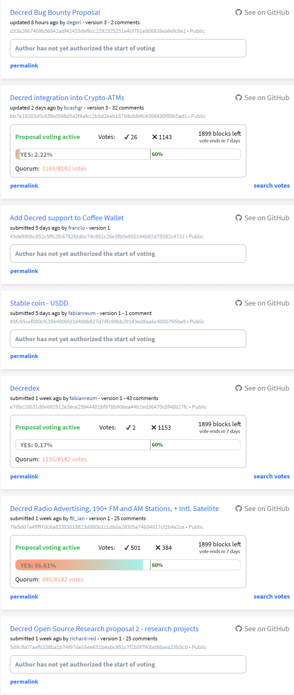

## Politeia Digest #7 - Nov 28th-Dec 4th 2018

**Treasury balance: 588,681 DCR (approx +16,718 DCR/month) - $11.8 million (+$335k/month) based on $20 DCR price**

### New Proposals

**[Decred Radio Advertising, 190+ FM and AM Stations, + Intl. Satellite](https://proposals.decred.org/proposals/7fe5d07a4ffff7dc6a83383018823d880b1c1db0a29305e74934817cf2b4e2ce) - submitted Nov 26 by ftl_ian, approved Nov 28, voting opened Dec 4 - 25 comments**

This is a proposal by Ian Freeman, one of the hosts of [Free Talk Live](http://freetalklive.com/), for Decred to sponsor the show. The proposer asks for $22,750 for 13 weeks of sponsorship, for which Decred would get a live promotion, 30 second radio ad each day and some banners. The proposal owner and co-host ([@medge2](https://proposals.decred.org/user/fc9b8afd-c10b-42cc-82d4-b354da10f14e)) have been engaging in a thorough discussion with the community. Several participants have expressed support for FTL and the proposal, while others have expressed a desire to wait and see how this kind of sponsorship opportunity fits into Decred's overall communications plan.

**[Decredex](https://proposals.decred.org/proposals/e78bc28631d0e682912e3ece25944481bf978b906ea44b1ed36470c0f48b27fc) - submitted Nov 26 by fabianreum, approved Nov 28, voting opened Dec 4 - 43 comments**

A proposal from [REUM Ltd](http://reum.io) for the development of a decentralized exchange. requesting a budget of $1,086,500 with a target completion date of Q2 2019. @jy-p [provided](https://proposals.decred.org/proposals/e78bc28631d0e682912e3ece25944481bf978b906ea44b1ed36470c0f48b27fc/comments/4) some context, the proposal owner had appeared in some chat channels in July but had not engaged with the project on a sustained basis. @jy-p also criticized the proposal heavily, as did many other commentors. The strongest critiques were about a lack of detail and lack of evidence that REUM can deliver. To their credit, the proposal owner responded to many criticisms in comments. @ryanzim [pointed out](https://proposals.decred.org/proposals/e78bc28631d0e682912e3ece25944481bf978b906ea44b1ed36470c0f48b27fc/comments/38) that REUM appear to have removed a page about "REUM Brand Agency" from their website after it had been criticized.

**[Stable coin - USDD](https://proposals.decred.org/proposals/85fc65cef080cfc3564906fd3d488b827d74fc99bb29143ed8aa6c400b765be9) - submitted Nov 29 by fabianreum, approved Dec 4 - 1 comment**

Another proposal by @fabianreum of Decredex/REUM and also Moentum, to set up and run a stablecoin backed by Decred. This would cost $1,576,000 over a 4 year period.

**[Decred integration into Crypto-ATMs](https://proposals.decred.org/proposals/bb7e19283d5c65fed598d5a2f4afcc2b5d2eab187b9cb84fc4304430f80b5ad1) - submitted Nov 24 by bcashgr, approved Nov 28, voting opened Dec 4 - 32 comments**

A proposal by the [Bcash](https://bcash.eu/) company to integrate Decred in the ATMs they run themselves, and those they sell to customers (for 2 years). The proposal requested a starting budget of 25,000 EUR and a monthly budget of 1,650 EUR equivalent in DCR for maintenance. Several comments object to the maintenance fee, some express support for the concept of ATMs in general but are reticent about this particular proposal. @oregonisaac [checked out](https://proposals.decred.org/proposals/bb7e19283d5c65fed598d5a2f4afcc2b5d2eab187b9cb84fc4304430f80b5ad1/comments/22) a number of ATM providers with regard to how they handle integrations and any fees they charge. In [response](https://proposals.decred.org/proposals/bb7e19283d5c65fed598d5a2f4afcc2b5d2eab187b9cb84fc4304430f80b5ad1/comments/25), @bcashgr edited their proposal to make an additional offer of also doing the integration work for GENERAL BYTES and LAMASSU.

**[Add Decred support to Coffee Wallet](https://proposals.decred.org/proposals/45de9806c952c5ffc2fc6782fddbc74c852c26e3fb0e950144b92d75082c4731) - submitted Nov 29 by francio, approved Dec 4 - 0 comments**

This proposal asks for 150 DCR to fund work on integrating DCR wallet support into Coffee Wallet, an open source multi coin wallet with a portfolio tracker.

**[Decred Bug Bounty Proposal](https://proposals.decred.org/proposals/d33a2667469b56942adf42453def6cc2292325251e4cf791e806939ea9efc9e1) - submitted Nov 30 by degeri, approved Dec 4 - 2 comments**

This proposal aims to establish a bug bounty program for Decred, through which anyone who reports a bug or vulnerability can be compensated. The bounty program will use PGP encrypted email for bug reports, and run a small website which explains the program and shows a "thank you" page crediting the reporters of major vulnerabilities. The proposal requests a budget of $5,000 for 6 months to cover setup and operations costs, and estimates an upper limit of $100,000 for payouts during this time. @degeri has put considerable effort into consulting with the community on how this bounty program should be operated, and in particular making sure that the current Decred contractors who would work with the program are on board. It is clear that there is support for this proposal among the most active participants on [reddit](https://www.reddit.com/r/decred/comments/9ubqmk/decred_bug_bounty_proposal/) and in chat, and the Politeia proposal is being used to establish that the broader stakeholder community also supports the program. Future proposal submitters could learn from @degeri's example.

### Proposals under discussion

**[Decred Open Source Research proposal 2 - research projects](https://proposals.decred.org/proposals/5d9cfb07aefb338ba1b74f97de16ee651beabc851c7f2b5f790bd88aea23b3cb) - submitted Nov 21 by richard-red, approved Nov 26th - 25 comments (+18)**

So far there are six top-level comments that suggest research subjects or projects, they are (in order of score): Pi Research, dcrtime/politeia Integrations Research, Governance Models Research, cryptocurrency use in countries with unstable macroeconomics, Decred Media Performance and Cryptocurrency social media research. The level of commenting and voting activity on the proposal has dropped off after the first few days, as anticipated, so it seems like the more recently posted ideas have had less community feedback. One of the challenges for using Pi proposals in this way is encouraging community members to return to the proposal periodically to see and respond to new ideas or developments of those ideas.

### Proposals update

The [PR](https://github.com/decred/dcrdocs/pull/590) to implement the [language change proposal](https://proposals.decred.org/proposals/522652954ea7998f3fca95b9c4ca8907820eb785877dcf7fba92307131818c75) (PoS Mining to PoS Voting, stakepools to VSPs) on docs.decred.org has been merged and deployed. 

### Politeia Development

Opt-in email **notifications** are now live on the mainnet proposals site, they can be enabled in the Account > Preferences page. There are a number of options for being notified about new proposals, proposals that start voting, and responses to one's own proposals or comments.

A **search votes** feature has been added which allows one to confirm that a specific ticket has voted on a proposal.

**Permalinks** for comments are live, and were missed in the previous issue. 

The **abandoned proposal** status is now live also, and has been used to mark 3 proposals with sustained inactivity as abandoned.

## About this issue

Content for this edition was authored by @richardred, with contributions from @bee.

Also available on [medium](https://medium.com/politeia-digest/issue-7-nov-28-dec-4-2018-bac012414d36).

If you have thoughts on how this format could be developed or would like to contribute, join the [Writers channel](https://matrix.to/#/!lbzTjhzNbIaDbuAxkS:decred.org) and let us know.
