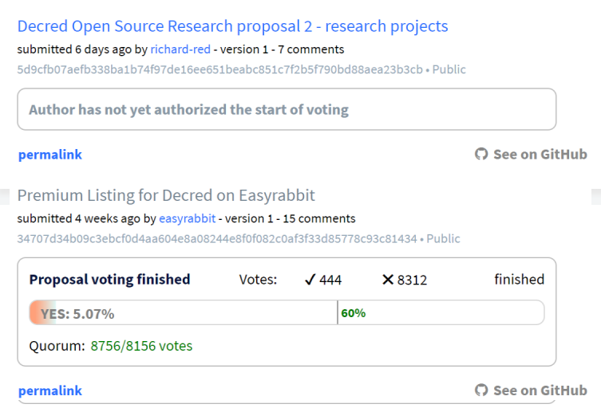

# Draft

Permalinks for comments, missed from previous

3 new proposals appeared on 28th

Language change prop PR merged

## Politeia Digest #7 - Nov 21st-Nov 27th 2018

**Treasury balance: 590,764 DCR (approx +16,718 DCR/month) - $11.8 million (+$335k/month) based on $20 DCR price**

### New Proposal

**[Decred Open Source Research proposal 2 - research projects](https://proposals.decred.org/proposals/5d9cfb07aefb338ba1b74f97de16ee651beabc851c7f2b5f790bd88aea23b3cb) - submitted Nov 21 by richard-red, approved Nov 26th - 7 comments**

This proposal is being used to host discussion on research projects and ideas for the program, and the body of the proposal will be used to list the projects that are open for contributions. All Politeia users are welcome to ask questions about proposed research projects and share their own question/project ideas.

### Rejected proposal

**[Premium Listing for Decred on Easyrabbit](https://proposals.decred.org/proposals/34707d34b09c3ebcf0d4aa604e8a08244e8f0f082c0af3f33d85778c93c81434) - submitted Oct 30th by easyrabbit, voting ended Nov 23rd - 15 comments (+1)**

444 Yes votes, 8,312 No votes (5% Yes) - voter participation of 21%, support from 1% of tickets.

### Politeia Discussions

@degeri [shared](https://matrix.to/#/!MIGqWXfLFBwhipPKYL:decred.org/$154324102625321rrnzj:decred.org) another iteration of their [bug bounty proposal](https://github.com/degeri/Decred-Bug-Bounty-Proposal). Among the changes are: the methology was changed from CVSS v3.0 to OWASP Risk Rating, a list of contractors to do the work was added, the payouts are estimated to not cross $100k for 6 months.

The subject of what happens to proposals that don't meet the quorum requirement was discussed. @davecgh [kicked off](https://matrix.to/#/!MIGqWXfLFBwhipPKYL:decred.org/$154281169322280KaecY:decred.org?via=decred.org&via=matrix.org&via=zettaport.com) the discussion by suggesting that should the Easyrabbit proposal fail to reach the quorum requirement another round of voting would be required - because in most contexts a quorum is required before a group can make binding decisions. Most people who commented are interpreting the meaning differently for Pi - failure to reach the quorum is one of two ways that proposals can fail (the other being <60% Yes votes).

@snr01 collected final versions of voting graphs in a [repository](https://github.com/snr01/PiVotingCharts).

@richardred shared the line graph below showing voting activity over time for each of the six proposals that have finished voting.

The dashed line indicates an approximate quorum requirement (20% of the 49.960 target for the ticket pool).

The first four proposals to go up for a vote started voting at the same time and had fairly similar voting rates for the first 4-5 days. At this point the only contentious proposal was Ditto's and it continued to receive votes at a high rate until the end of the voting window. The easyrabbit proposal stands out here in that it had a much lower voter participation level than the others, and didn't reach the quorum requirement until near the end of the voting period.

## About this issue

Content for this edition was authored by @richardred, with contributions from @bee

Also available on [medium](https://medium.com/politeia-digest/issue-6-nov-21-nov-27-2018-3260d03d26a1).

If you have thoughts on how this format could be developed or would like to contribute, join the [Writers channel](https://matrix.to/#/!lbzTjhzNbIaDbuAxkS:decred.org) and let us know.
