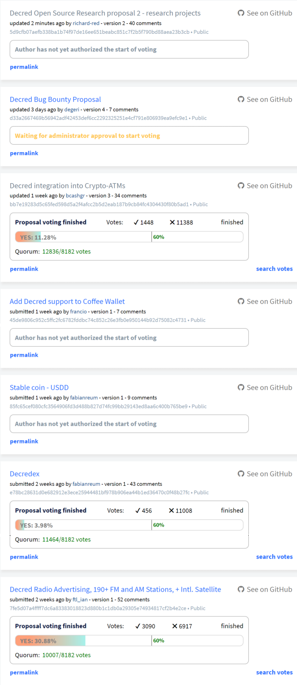

## Politeia Digest #8 - Dec 5th-Dec 11th 2018

**Treasury balance: 592,517 DCR (approx +16,718 DCR/month) - $8.8 million (+$247k/month) based on $14.80 DCR price**

### Proposals under discussion

**[Decred Open Source Research proposal 2 - research projects](https://proposals.decred.org/proposals/5d9cfb07aefb338ba1b74f97de16ee651beabc851c7f2b5f790bd88aea23b3cb) - submitted Nov 21 by richard-red, appeared Nov 26th, edited Dec 11th - 40 comments (+15)**

There were 3 new top-level comments this week, [Decred git/contributor analysis](https://proposals.decred.org/proposals/5d9cfb07aefb338ba1b74f97de16ee651beabc851c7f2b5f790bd88aea23b3cb/comments/34), [Novel ways to increase network effect](https://proposals.decred.org/proposals/5d9cfb07aefb338ba1b74f97de16ee651beabc851c7f2b5f790bd88aea23b3cb/comments/30), and [adversarial research](https://proposals.decred.org/proposals/5d9cfb07aefb338ba1b74f97de16ee651beabc851c7f2b5f790bd88aea23b3cb/comments/29). @richard-red updated the proposal on Dec 11 to list 3 initial projects being worked on ([Pi Research](https://github.com/RichardRed0x/pi-research), [Decred git/contributor Analysis](https://github.com/degeri/decred_contributor_track), [Decred Media Performance](https://github.com/RichardRed0x/decred-media-tracker)), and noted that there are several further strong and well-supported ideas which could start work if they were better operationalized. 

**[Stable coin - USDD](https://proposals.decred.org/proposals/85fc65cef080cfc3564906fd3d488b827d74fc99bb29143ed8aa6c400b765be9) - submitted Nov 29 by fabianreum, appeared Dec 4 - 9 comments (+8)**

Comments offer thorough and damning criticism of this proposal for a Decred backed stablecoin, in [short form](https://proposals.decred.org/proposals/85fc65cef080cfc3564906fd3d488b827d74fc99bb29143ed8aa6c400b765be9/comments/2) from @nnnko56, [long form](https://proposals.decred.org/proposals/85fc65cef080cfc3564906fd3d488b827d74fc99bb29143ed8aa6c400b765be9/comments/7) from @ryanzim.

**[Add Decred support to Coffee Wallet](https://proposals.decred.org/proposals/45de9806c952c5ffc2fc6782fddbc74c852c26e3fb0e950144b92d75082c4731) - submitted Nov 29 by francio, appeared Dec 4 - 7 comments (+7)**

This proposal asks for 150 DCR to fund work on integrating DCR wallet support into Coffee Wallet, an open source multi coin wallet with a portfolio tracker. Comments indicate that although the fee being requested is quite reasonable, it may not be a good idea for Decred to start paying for wallet integrations. The proposal owner has [offered](https://proposals.decred.org/proposals/45de9806c952c5ffc2fc6782fddbc74c852c26e3fb0e950144b92d75082c4731/comments/7) to reduce the requested amount to 75 DCR.

**[Decred Bug Bounty Proposal](https://proposals.decred.org/proposals/d33a2667469b56942adf42453def6cc2292325251e4cf791e806939ea9efc9e1) - submitted Nov 30 by degeri, appeared Dec 4 - 7 comments (+5)**

@degeri continued to edit the proposal in response to community feedback, tightening the scope and adding a clarification about not paying out for bugs reported before the program starts. On Dec 10 @degeri authorized the start of voting.

### Rejected proposals

**[Decred Radio Advertising, 190+ FM and AM Stations, + Intl. Satellite](https://proposals.decred.org/proposals/7fe5d07a4ffff7dc6a83383018823d880b1c1db0a29305e74934817cf2b4e2ce) - voting closed Dec 11 - 52 comments (+27)**

3,090 Yes votes, 6,917 No votes (30.9% Yes) - voter participation of 24.4%, support from 7.5% of tickets.

**[Decredex](https://proposals.decred.org/proposals/e78bc28631d0e682912e3ece25944481bf978b906ea44b1ed36470c0f48b27fc) - voting closed Dec 11 - 43 comments (+0)**

456 Yes votes, 11,008 No votes (4% Yes) - voter participation of 28%, support from 1.1% of tickets.

**[Decred integration into Crypto-ATMs](https://proposals.decred.org/proposals/bb7e19283d5c65fed598d5a2f4afcc2b5d2eab187b9cb84fc4304430f80b5ad1) - voting closed Dec 11 - 34 comments (+2)** 

1,448 Yes votes, 11,388 No votes (11.3% Yes) - voter participation of 31.4%, support from 3.5% of tickets

### Proposals update

@Dustorf continued to provide updates on the relationship with Ditto, which formally began at the start of December. This [update](https://matrix.to/#/!OfChXgczrIlpEZSFAv:decred.org/$154413732235771XIVBH:decred.org?via=decred.org&via=matrix.org) in the #Marketing channel offered details of a meeting with @jy-p and Ditto in New York.

> jy-p and I met with the DittoPA team today for about 2-1/2 hours in Brooklyn. They had dome a significant amount of work reviewing Decred's marketing materials (off Github), website, blogs, reddit, social media, Medium, etc. We also went through the story of btcsuite, memcoin2, and Decred. We began the discussion by talking about targeting and arrived upon the following five segments:
>
> 1. Developers-back-end devs are currently the bottleneck. We discussed a strategy to target people who have full-time jobs, but are looking for more fulfilling work they can do on the side.
> 2. Individual investors/contributors-people who are knowledgeable about crypto, see the existing system as corrupt and broken, are tech-savvy and concerned with privacy
> 3. Institutions-We’re looking for the smart money institutions like Placeholder who understand that Decred is built for the long run, and are excited to actively participate and contribute to the project
> 4. Media-outreach to spread the Decred story, make those groups above aware of what we’re doing and how it’s relevant to them
> 5. Governments-demonstrate to states and municipalities that Decred’s Politeia time-stamping system has myriad applications that can be freely used and can make lives better

### Politeia Development

### Politeia analysis

Note about tickets voting for >1 prop in a session, pointer for UX.

Vote activity charts for latest round of props.

## About this issue

Content for this edition was authored by @richardred, with contributions from @bee.

Also available on [medium](https://medium.com/politeia-digest/issue-7-nov-28-dec-4-2018-bac012414d36).

If you have thoughts on how this format could be developed or would like to contribute, join the [Writers channel](https://matrix.to/#/!lbzTjhzNbIaDbuAxkS:decred.org) and let us know.

