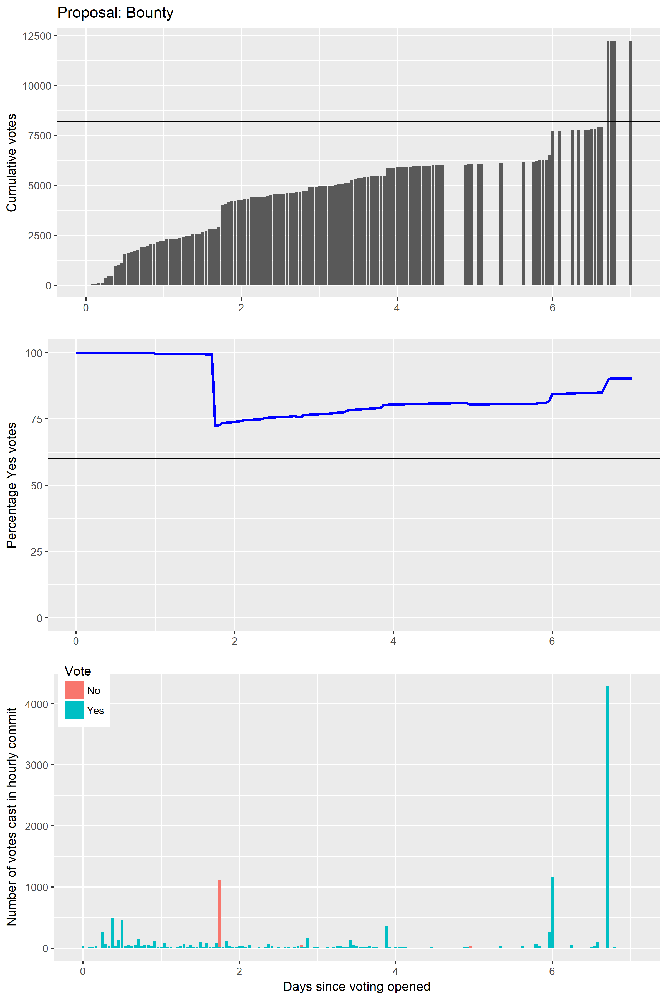
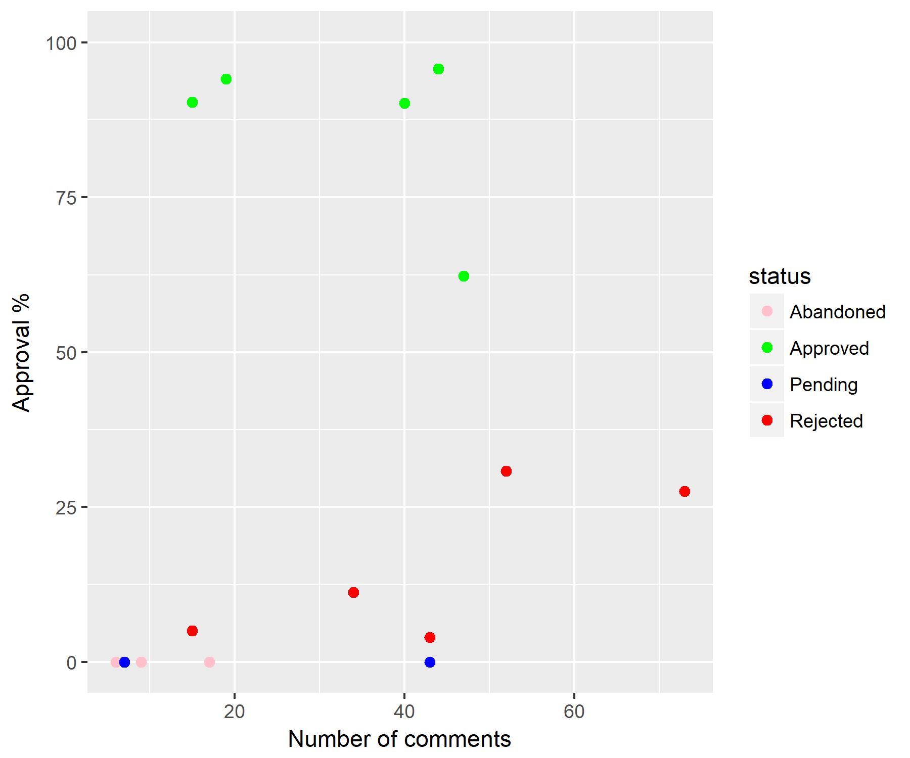
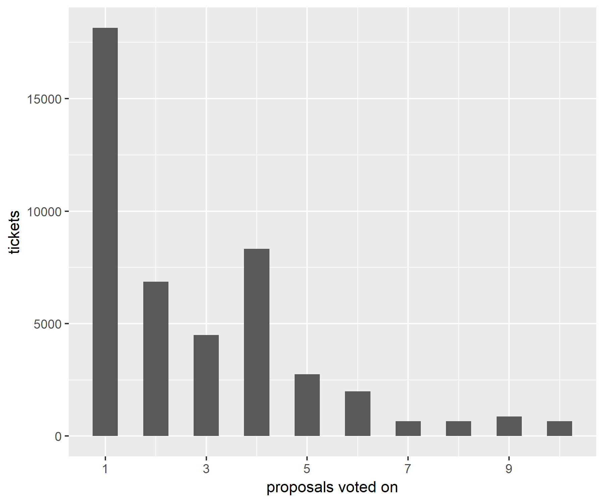
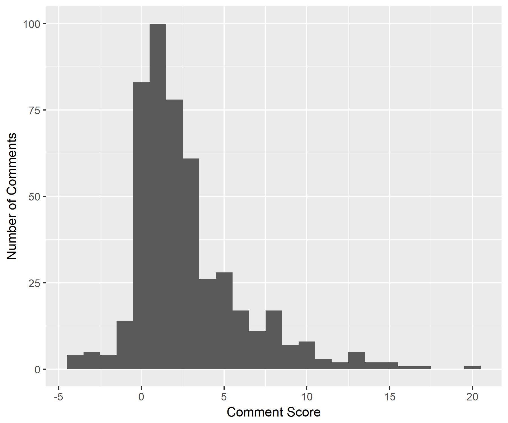
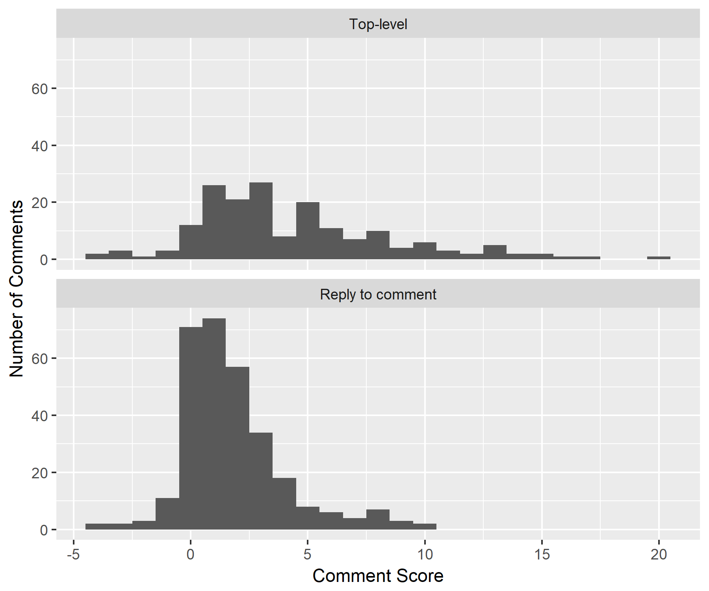
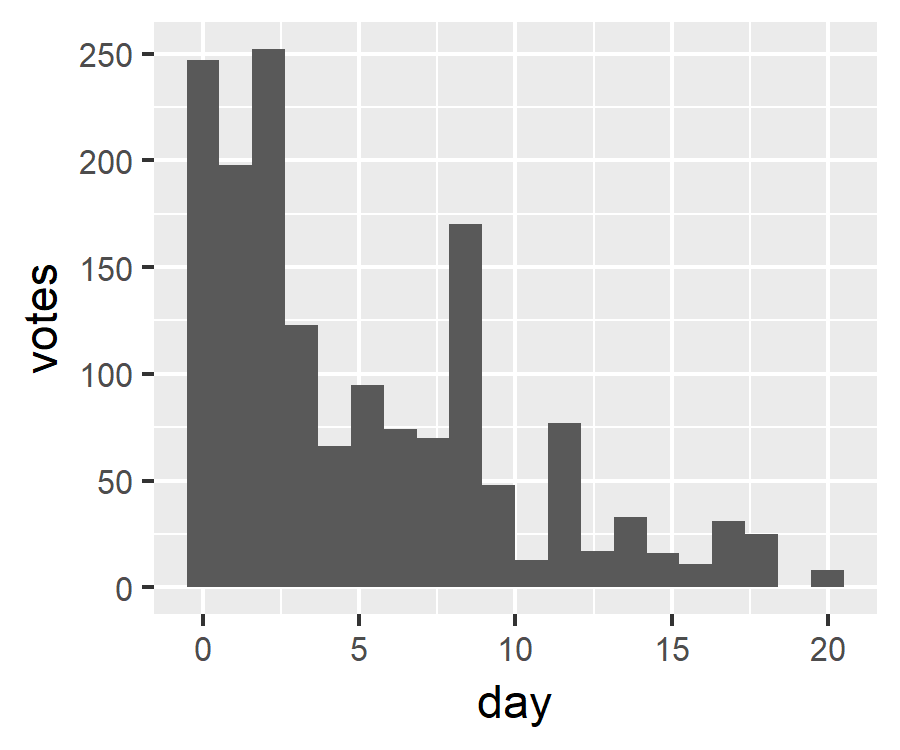
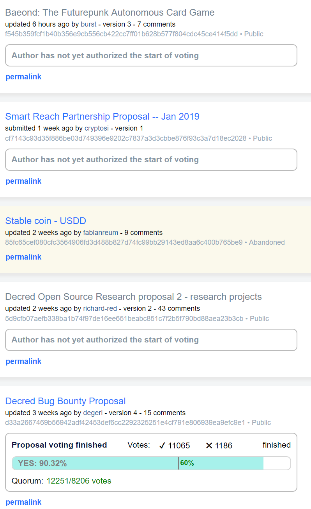

## Politeia Digest #9 - Dec 12th-Dec 31st 2018

**Treasury balance: 597,063 DCR (approx +16,552 DCR/month) - $10.2 million (+$281k/month) based on $17 DCR price**

I decided to give Politeia Digest a rest over the holiday season as there was not much happening on the proposals site. For now it will be switching to a "weekly or whenever something interesting happens" model.

This is a **special year end edition** in which I will present some stats and graphs about Politeia activity for (the last two months of) 2018.

### New proposals

**[Baeond: The Futurepunk Autonomous Card Game](https://proposals.decred.org/proposals/f545b359fcf1b40b356e9cb556cb422cc7ff01b628b577f804cdc45ce414f5dd) - submitted Dec 21 by burst, appeared Dec 30 - 8 comments**

This proposal is about a Futurepunk Autonomous Card Game that would fork Decred and use it as a foundation for the game. The attraction of using Decred seems to be ticket-based governance and the prospective DEX. In exchange for 13,000 DCR (about $220k) Decred would become a technology partner for the game, and Playproof LLC would "staff one engineer exclusively with maintaining $DCR changes from upstream". The proposal initially asked for a lump-sum payment up front, it has been edited, in response to community feedback, to amend this to monthly payments over a 7.5 month period.

**[Smart Reach Partnership Proposal -- Jan 2019](https://proposals.decred.org/proposals/cf7143c93d35f886be03d749396e9202c7837a3d3cbbe876f93c3a7d18ec2028) - submitted Dec 21 by cryptosi, appeared Dec 30 - 0 comments**

This proposal is about a paid partnership with Smart Reach involving sponsorship of a podcast and conference calls about governance proposals. This proposal was followed up by a [pre-proposal on reddit](https://www.reddit.com/r/decred/comments/a9o1wj/preproposal_smart_reach_partnership_proposal_jan/) on Dec 26, while it was awaiting admin review on Politeia. @cryptosi also joined the Decred Slack and discussed the proposal and the ITK Crypto podcast in a number of channels, including #[proposals](https://matrix.to/#/!MIGqWXfLFBwhipPKYL:decred.org/$15458333142014pISQV:decred.org?via=decred.org&via=matrix.org&via=zettaport.com). @cryptosi has experience with other governance-related projects, having [been](https://matrix.to/#/!MIGqWXfLFBwhipPKYL:decred.org/$15458333142014pISQV:decred.org?via=decred.org&via=matrix.org&via=zettaport.com) a PIVX Core team member for 2 years and a Dash MNO before that. Although the proposal did not include any specific budget, @cryptosi mentioned ballpark figures of 50-100 DCR per cycle/month in a [reddit comment](https://www.reddit.com/r/decred/comments/a9o1wj/preproposal_smart_reach_partnership_proposal_jan/ecl0cbc). This was [followed up](https://matrix.to/#/!MIGqWXfLFBwhipPKYL:decred.org/$15458323211999TKZne:decred.org?via=decred.org&via=matrix.org&via=zettaport.com) in the proposals channel by @Aspen Shredder pointing out that this was $900-$1,800 per month. 

### Approved proposal

**[Decred Bug Bounty Proposal](https://proposals.decred.org/proposals/d33a2667469b56942adf42453def6cc2292325251e4cf791e806939ea9efc9e1) - voting finished Dec 27th - 15 comments (+8)**

11,065 Yes votes, 1,186 No votes (90.3% Yes) - voter participation of 30%, support from 27% of tickets.

*Recap: @degeri put this proposal together over several rounds of consultation with the community, it establishes a bug bounty program in which those who report bugs following the requested procedure will be eligible to receive payments in line with the importance or severity of the bugs.* 

This one really went down to the wire in terms of meeting the 20% quorum requirement. As with previous proposals that didn't reach quorum until late in the voting period, it prompted some discussion of voter participation. With a few hours to go, the Decred whale that has been spotted voting with 4k+ tickets on previous proposals showed up again to send this one flying over the quorum requirement.

### Proposals under discussion

**[Decred Open Source Research proposal 2 - research projects](https://proposals.decred.org/proposals/5d9cfb07aefb338ba1b74f97de16ee651beabc851c7f2b5f790bd88aea23b3cb) - submitted Nov 21 by richard-red, appeared Nov 26th, edited Dec 11th - 43 comments (+3)**

A top-level comment has recently been added by @jazzah, suggesting Block Voting Research. This would involve 1) defining miner behaviors that are dubious or of interest to track, 2) developing queries to identify the behaviors on the Decred blockchain, 3) checking historical data, and 4) exploring ways of using block voting instructions to reject unwanted miner behaviors.

The Pi Research project has been progressing with new scripts for analyzing and visualizing ticket voting data (see above and also stats section below). The git/contributor analysis project already has beta code to identify new Decred contributors and will be kicking on in January.

**[Stable coin - USDD](https://proposals.decred.org/proposals/85fc65cef080cfc3564906fd3d488b827d74fc99bb29143ed8aa6c400b765be9) - updated Dec 17 by fabianreum - 9 comments (+0)**

The proposal owner edited the body of the proposal to say "Cancelled", and it was changed to abandoned status by an admin.

## Politeia stats for 2018

A total of 18 proposals have been submitted since Politeia went live on October 16th. 5 have been approved and 5 have been rejected by voters, with another 5 being abandoned by their owner rather than start voting.

This scatterplot shows each proposal's ultimate approval % (y axis) and number of comments it attracted. Abandoned and pending proposals have been included as approval 0%. There appears to be a relationship between proposal controversy (approval percentages closer to 50%) and more comments. 

Proposals that are ultimately abandoned tend to not to receive many comments. The set of abandoned proposals includes some early ones where the proposal owners did not respond to any comments, those went quiet fairly quickly. 

A total of 128,791 ticket votes have been cast on the 10 proposals that have finished voting so far. There are 45,434 different tickets that have voted on at least one proposal each. There are 662 tickets that have voted on every one of the 10 proposals so far.

#### Proposal site comments and up/down votes

There have been 480 comments ( ~27 per proposal) and 1,673 up/down votes on comments (~3.5 per comment). 10.5% of the votes have been downvotes. So far, 115 Politeia users have participated by commenting and/or up/down voting on comments.

There were 27 comments that received negative scores, 83 that have a score of 0 (usually no votes), and 370 with a positive score. The median score is 2. Top-level comments (direct reply to proposal) have higher mean scores (4.4) than comments that are replies to other comments (1.8). I ran a quick independent samples t-test and no surprise that's a significant effect (p < 0.001). 

Most comment voting activity happens early, so early top-level comments tend to have the highest scores. 45% of comment votes are cast in the first 3 days a proposal is open.

## About this issue

Content for this edition was authored by @richardred, with contributions from @bee.

Also available on [medium](https://medium.com/politeia-digest/issue-8-dec-5-dec-11-2018-23bb061a08a0).

If you have thoughts on how this format could be developed or would like to contribute, join the [Writers channel](https://matrix.to/#/!lbzTjhzNbIaDbuAxkS:decred.org) and let us know.

### Snapshot

