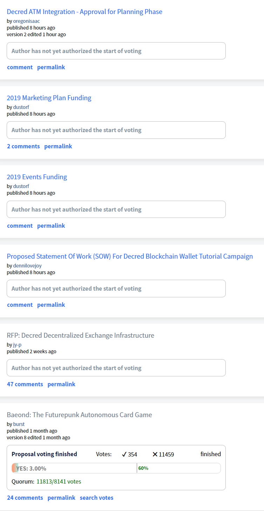

## Politeia Digest #10 - Jan 1st-Feb 18th 2018

**Treasury balance: 613,366 DCR (approx +16,226 DCR/month) - $10.9 million (+$288,823k/month) based on $17.80 DCR price**

### New proposals

**[RFP: Decred Decentralized Exchange Infrastructure](https://proposals.decred.org/proposals/5431da8ff4eda8cdbf8f4f2e08566ffa573464b97ef6d6bae78e749f27800d3a) - submitted Feb 3 by jy-p, published Feb 4 - 47 comments**

This proposal seeks to establish stakeholder support for building decentralized exchange infrastructure - "a new type of cryptocurrency-only decentralized exchange based on open source software that will allow cross-chain trading to occur directly between users, with minimal fees and a simple client-server architecture." If it is approved, this will trigger a Request for Proposals (RFP) process whereby interested developers are invited to put forward proposals for how they would go about the task and how much they would charge. This proposal sets a limit for the requested budget to between USD 100,000 and 1,000,000, although jy-p has [indicated](https://proposals.decred.org/proposals/5431da8ff4eda8cdbf8f4f2e08566ffa573464b97ef6d6bae78e749f27800d3a/comments/17) that this will be revised downward in response to comments from the community. 

Many of the comments on the proposal [question](https://proposals.decred.org/proposals/5431da8ff4eda8cdbf8f4f2e08566ffa573464b97ef6d6bae78e749f27800d3a/comments/3) [whether](https://proposals.decred.org/proposals/5431da8ff4eda8cdbf8f4f2e08566ffa573464b97ef6d6bae78e749f27800d3a/comments/4) this is a good use of Treasury funds - at the current DCR/USD exchange rate the proposal would be spending 1-10% of the Treasury's current balance. Another common [question](https://proposals.decred.org/proposals/5431da8ff4eda8cdbf8f4f2e08566ffa573464b97ef6d6bae78e749f27800d3a/comments/5) is whether the DEX will be able to attract liquidity, to which jy-p [responded](https://proposals.decred.org/proposals/5431da8ff4eda8cdbf8f4f2e08566ffa573464b97ef6d6bae78e749f27800d3a/comments/14) that a number of DCR holders have expressed interest in making the market for DCR/BTC on this kind of exchange. 

**[Proposed Statement Of Work (SOW) For Decred Blockchain Wallet Tutorial Campaign](https://proposals.decred.org/proposals/a3def199af812b796887f4eae22e11e45f112b50c2e17252c60ed190933ec14f) - submitted Feb 13 by dennilovejoy, published Feb 18 - 0 comments**

A pre-proposal was [posted](https://www.reddit.com/r/decred/comments/anksg2/proposed_statement_of_work_sow_for_decred/) on /r/decred on February 5th, the post has 14 comments in which community members made observations and suggestions about the proposal and @dennilovejoy responded and significantly modified their proposal. 

The proposal on on Pi requests a budget of $1,000 for the production of four tutorial videos in which @dennilovejoy will show and talk through processes like setting up a wallet in Decrediton, setting up a VSP account, and setting up a Politeia account. @dennilovejoy also included a [link](https://www.youtube.com/watch?v=HKwnEpFDN3Q&list=PLMBYy3lWO3Dmx-xHInb66OPcYQgmmcOEt) to similar videos they have produced about other projects, the videos produced for Decred if this proposal is approved would be hosted on a Decred channel and utilize Decred design assets.

**[2019 Events Funding](https://proposals.decred.org/proposals/d3e7f159b9680c059a3d4b398de2c8f6627108f28b7d61a3f10397acb4b5e509) - submitted Feb 14 by dustorf, published Feb 18 - 0 comments** 

This proposal sets out a plan and budget for Decred's attendance at events in 2019. The total budget requested is $200k,  with $150k to fund a Decred presence at one major event in each of North America, Europe and Asia (50k each). Examples of the kind of event being considered are given, but these are provisional as no agreements have yet been made. There is a further 50k budget requested to send individual speakers to relevant events, should they submit talks/sessions which are accepted by the organizers. @dustorf would be the final decision-maker on which events to attend, with input from the community.

**[2019 Marketing Plan Funding](https://proposals.decred.org/proposals/c84a76685e4437a15760033725044a15ad832f68f9d123eb837337060a09f86e) - submitted Feb 15 by dustorf, published Feb 18 - 2 comments**

A pre-proposal was [posted](https://www.reddit.com/r/decred/comments/aolr79/politeia_proposal_to_fund_marketing_ops_for_2019/) on /r/decred on Feb 8th, where it received 50 comments and @dustorf responded to questions from the community. 

This proposal requests a budget of $290k for marketing activities for the rest of 2019, divided into planned ($220k) and discretionary ($70k) spending buckets. Planned spending includes: $100k to support the growth of local communities and organizers in target markets; $65k for a round of updates to decred.org; $35k for a series of 10 Decred Assembly videos; $10k for 10 episodes of a new Decred in Depth podcast; and $5k each for a monthly newsletter and internship program. The proposed budget also includes $70k for discretionary spending on new initiatives during the year, with these decisions being made in the #marketing and #marketing_ops channels.

**[Decred ATM Integration - Approval for Planning Phase](https://proposals.decred.org/proposals/aea224a561cfed183f514a9ac700d68ba8a6c71dfbee71208fb9bff5fffab51d) - submitted Feb 18 by oregonisaac, published Feb 18 - 0 comments**

@oregonisaac has been developing this proposal openly with feedback from the community for some time. It started with some [initial research](https://proposals.decred.org/proposals/bb7e19283d5c65fed598d5a2f4afcc2b5d2eab187b9cb84fc4304430f80b5ad1/comments/22) into ATM availability while the Bcash ATM integration [proposal](https://proposals.decred.org/proposals/bb7e19283d5c65fed598d5a2f4afcc2b5d2eab187b9cb84fc4304430f80b5ad1) was being discussed in November. Since then, @oregonisaac has contacted major ATM providers and [shared](http://zer0byte.com/zeropastebin/?486d12a5d9413a9e#EOvkXU8zNW0fQZOEExMCr9Lf04BdK3hyuic7ZqyrVus=) [several](https://gist.github.com/oregonisaac/c25bac8e0ee9d4e99997b230885296eb) updates and drafts of a proposal which frames some integration work with General Bytes ATMs. The submitted proposal seeks approval to move forward with planning and a Request for Proposal process. If this initial proposal is approved, a further proposal would be submitted with details of a particular dev team that will complete the work, and their terms. 

### Rejected proposals

**[Baeond: The Futurepunk Autonomous Card Game](https://proposals.decred.org/proposals/f545b359fcf1b40b356e9cb556cb422cc7ff01b628b577f804cdc45ce414f5dd)  - voting finished Jan 23 - 24 comments (+16)**

354 Yes votes, 11,459 No votes (3% Yes) - voter participation of 29%, support from <1% of tickets.

The Baeond proposal was edited 8 times in total in response to discussions with the community. On Jan 6 the proposal was edited to include an offer of airdropping starter packs of cards to Decred holders. 

While several commenters expressed interest in the game, there was almost universal agreement that it would not be appropriate for Decred to fund its development. This sparked a broader discussion about investing from the Treasury (captured in this [issue](https://github.com/xaur/decred-issues/issues/61)). 

nnnko56 made a [comment](https://proposals.decred.org/proposals/f545b359fcf1b40b356e9cb556cb422cc7ff01b628b577f804cdc45ce414f5dd/comments/14) which resonated with many, and which went on to inspire expanded [guidelines](https://docs.decred.org/governance/politeia/proposal-guidelines/) on docs:

> The treasury is not a venture capital fund, politeia isn't a platform to allocate grants. And stakeholders are not a group of investors looking to spend money on random cool ideas (even if they are really cool).
>
> The treasury is a precious and fragile insurance policy. It's the energy source to keep Decred evolving, growing staying secure, implementing required changes, and staying relevant in the future ahead.
>
> At the moment, the primary question that anyone who want to make a proposal should ask beforehand IMO is: Who is the primary beneficiary of this proposal? " If the answer is not Decred or the Decred ecosystem, or the Decred Community, expect strong opposition from stakeholders..

### Other News

A new twitter account was started which will send simple tweets to notify when proposals are created/modified or start/finish voting - [@pi_crumbs](https://twitter.com/pi_crumbs). This account could be [automated](https://gist.github.com/RichardRed0x/33b5685c73e89155da3d728a0eaa4a9b) with a bot, but will initially be operated manually to determine whether there is demand for it. The intention is to add another [notification](https://github.com/xaur/decred-issues/issues/24) channel for Politeia and stimulate discussion of the proposals on twitter.

Francio (Coffee wallet [proposer](https://proposals.decred.org/proposals/45de9806c952c5ffc2fc6782fddbc74c852c26e3fb0e950144b92d75082c4731)) [appeared](https://matrix.to/#/!MgQoetFiyjrHAywokv:decred.org/$15467875879232uBQcG:decred.org?via=decred.org&via=matrix.org&via=zettaport.com&via=gwusbdhdu.org) in chat to say they did not mean to abandon their proposal. Once a proposal is abandoned this cannot be reversed, so Francio was advised that they would have to submit the proposal again if they want it to be considered.

A feature has been added to the proposal site which allows for viewing previous versions of a proposal through the interface. It appears next to the proposal title on the pages of proposals which have been edited.

## About this issue

Content for this edition was authored by @richardred, with contributions from @bee.

Also available on [medium](https://medium.com/politeia-digest/issue-9-dec-12-dec-31-2018-67b65b5bf30).

### Snapshot

