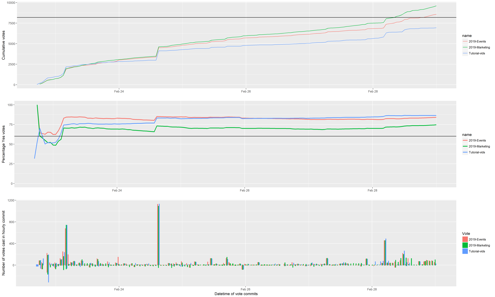
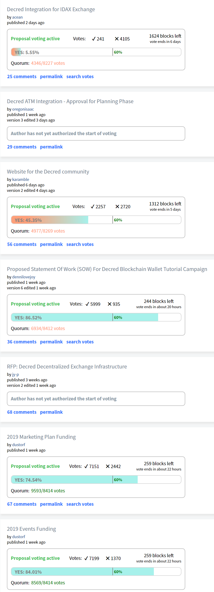

# Politeia Digest #11 - Feb 19 - Feb 28 2019

**Treasury balance: 601,331 DCR (approx +16,065 DCR/month) - $10 million (+$268k/month) based on $16.70 DCR price**

### Proposals open for voting

New proposal: **[Website for the Decred community](https://proposals.decred.org/proposals/fb8e6ca361c807168ea0bd6ddbfb7e05896b78f2576daf92f07315e6f8b5cd83) - published Feb 22 by karamble, last updated Feb 24 - voting started on Feb 25 - 58 comments (+58)**
Latest voting figures: 2,265 Yes votes, 2,734 No votes (45.3% Yes) - voter participation of 12.2%, support from 6% of tickets.

This proposal seeks funding to further develop a [prototype](https://decredcommunity.com) of a community hub website. This community website would record and present information about Decred content (articles, videos, podcasts), events and merchants. The proposal asks for $6,000 to cover the initial development of the prototype (already completed), and a further monthly budget of up to $700 to cover server costs and time spent maintaining and developing the site (charged at $35 per hour). This budget would be authorized for six months initially, another proposal would be made to extend it or if a larger budget was needed. Comments on the proposal express a range of views, most high-scoring comments are generally positive. @karamble has replied to many questions, in depth where required. 

New proposal: **[Decred Integration for IDAX Exchange](https://proposals.decred.org/proposals/60adb9c0946482492889e85e9bce05c309665b3438dd85cb1a837df31fbf57fb) -  published Feb 26 by acean - voting started on Feb 26 - 25 comments (+25)**
Latest voting figures: 241 Yes votes, 4,115 No votes (5.5% Yes) - voter participation of 10.6%, support from <1% of tickets.

This proposal seeks 1,000 DCR to integrate Decred on the IDAX exchange and enable a BTC/DCR trading pair, as well as displaying a "Decred Project Introduction" on the IDAX Homepage and discounted fees for IDAX events. Comments suggest that the cost is too high and/or that the Treasury should not pay for exchange listings in general. @acean has been active in responding to comments. This proposal moved quickly to voting, progressing through the Politeia flow faster than any other proposal to date, by some margin.

**[2019 Marketing Plan Funding](https://proposals.decred.org/proposals/c84a76685e4437a15760033725044a15ad832f68f9d123eb837337060a09f86e) - voting started on Feb 22 - 68 comments (+66)**
Latest voting figures: 7,165 Yes votes, 2,443 No votes (74.6% Yes) - voter participation of 23.5%, support from 17% of tickets.

*Recap: This proposal requests a budget of $290k for marketing activities for the rest of 2019, divided into planned ($220k) and discretionary ($70k) spending buckets. Planned spending includes: $100k to support the growth of local communities and organizers in target markets; $65k for a round of updates to decred.org; $35k for a series of 10 Decred Assembly videos; $10k for 10 episodes of a new Decred in Depth podcast; and $5k each for a monthly newsletter and internship program. The proposed budget also includes $70k for discretionary spending on new initiatives during the year, with these decisions being made in the #marketing and #marketing_ops channels.*

Many of the high-scoring comments on this proposal discuss it as a step towards greater decentralization of Treasury spending, with some suggesting that it would be better broken into smaller proposals and/or proposals of shorter duration. Some comments are more negative, and object to the size of the budget being dedicated to marketing efforts or how it is proposed to be managed. Some negative comments address @Dustorf directly in an abrasive manner, asking for details of his pay and denouncing the proposal as a "cash grab". @Dustorf has been active in responding to comments.

**[2019 Events Funding](https://proposals.decred.org/proposals/d3e7f159b9680c059a3d4b398de2c8f6627108f28b7d61a3f10397acb4b5e509) - voting started on Feb 22 - 16 comments (+16)**
Latest voting figures: 7,208 Yes votes, 1,370 No votes (84% Yes) - voter participation of 20.9%, support from 18% of tickets.

*Recap: This proposal sets out a plan and budget for Decred's attendance at events in 2019. The total budget requested is $200k, with $150k to fund a Decred presence at one major event in each of North America, Europe and Asia (50k each). Examples of the kind of event being considered are given, but these are provisional as no agreements have yet been made. There is a further 50k budget requested to send individual speakers to relevant events, should they submit talks/sessions which are accepted by the organizers. @dustorf would be the final decision-maker on which events to attend, with input from the community.*

The high-scoring comments on this proposal are generally supportive, and ask questions about the reasoning behind past and proposed events spending. @Dustorf has been active in responding to comments.

**[Proposed Statement Of Work (SOW) For Decred Blockchain Wallet Tutorial Campaign](https://proposals.decred.org/proposals/a3def199af812b796887f4eae22e11e45f112b50c2e17252c60ed190933ec14f) - voting started on Feb 21 - 37 comments (+37)**
Latest voting figures: 5,999 Yes votes, 935 No votes (86.5% Yes) - voter participation of 16.9%, support from 15% of tickets.

*Recap: The proposal on Pi requests a budget of $1,000 for the production of four tutorial videos in which @dennilovejoy will show and talk through processes like setting up a wallet in Decrediton, setting up a VSP account, and setting up a Politeia account. @dennilovejoy also included a [link](https://www.youtube.com/watch?v=HKwnEpFDN3Q&list=PLMBYy3lWO3Dmx-xHInb66OPcYQgmmcOEt) to similar videos they have produced about other projects, the videos produced for Decred if this proposal is approved would be hosted on a Decred channel and utilize Decred design assets.*

The proposal has been [edited](https://github.com/decred-proposals/mainnet/pull/1/commits/c394bb670818339dfc42b040c122b56e4793a7f5) to rearrange the tutorial videos in response to comments, and also to reduce the requested budget from $1,000 to $750. Comments discuss whether this is something the Treasury should fund, but generally find the proposed budget to be reasonable. @dennilovejoy has been active in responding to comments.

This chart shows voting over time for the 3 proposals which started voting at around the same time and are due to finish voting on March 1. Top: Cumulative votes per (hourly) commit, Middle: cumulative % of Yes 
votes at each commit, Bottom: new Yes and No votes in each commit.

### Proposals under discussion

**[RFP: Decred Decentralized Exchange Infrastructure](https://proposals.decred.org/proposals/5431da8ff4eda8cdbf8f4f2e08566ffa573464b97ef6d6bae78e749f27800d3a) - published Feb  4 by jy-p, last updated Feb 19 - 68 comments (+21)**

The proposal was updated to reduce the scope of the MVP and the maximum budget which can be requested in a subsequent stage to $250,000 (from $1 million).

**[Decred ATM Integration - Approval for Planning Phase](https://proposals.decred.org/proposals/aea224a561cfed183f514a9ac700d68ba8a6c71dfbee71208fb9bff5fffab51d) - published Feb 18 by oregonisaac, last updated Feb 25 - 31 comments (+31)**

Some comments are supportive of this proposal and others question the benefits of ATM integration or whether the Treasury should fund it.

### Other News

A new twitter account has been created to tweet regular updates on Politeia action: [Slices of Pi](https://twitter.com/slices_of_pi).

New comment indicators have been added to the site which, for signed in users, visually indicate new comments since the last time the user viewed a proposal's page.

A change to the default comment sorting algorithm is being [discussed](https://github.com/decred/politeiagui/issues/1022). The frequency of comments has increased considerably with the latest round of proposals, with more short comments and a significant number of comments from some new accounts. There appears to be consensus that the higher volume of comments means a switch to a default sort that uses comment scores (which should make higher-quality comments more visible) is warranted.

The table below shows the 10 users who have submitted the most comments since the last issue of Politeia digest (Feb 18th). Three of these users are proposal submitters, who have been commenting in response to the questions of others. There are also two other new (or newly active) users who have made a significant number of comments, but whose comments do not seem to be valued by other users (according to their voting scores).

| user         | comments | comments score | pubkey                                                       |
| ------------ | -------- | -------------- | ------------------------------------------------------------ |
| bee          | 50       | 91             | a717216ef1999f84d71aec664b4d14f90616a09b67c7c68892b8e8fe9e8b1441 |
| s-z          | 26       | 5              | b23de44909614c81f567a3c14a223a023c092bed742ae511c031adeb7509e8d8 |
| alexis       | 21       | -57            | 2323bc09222c6f68ed63c96da24bc735d3b5b4bca674714b0130fedebe7e29e7 |
| xiaozhu1717  | 18       | 10             | e17e89ac5a0f9b6af23af0fed3bd39520b64fefe4f7c928b51fa0c2721c769ff |
| dennilovejoy | 17       | 18             | cd71155ab0f7944118e8a9ed46bdde77d4724f61f2c9ebffaf898308f0185b92 |
| sambiohazard | 13       | 20             | 8b0efb1cdd09ced8194163ee0ea3b07f36c5507e90a02ca25a67bca9479448ee |
| karamble     | 13       | 25             | e0e3133b3d628b5975dc30151aa9e1c66491595d90a84f5fde5a2ef5edb4d831 |
| acean        | 11       | 0              | 3ec408dc7c50dd4dfc02c3264c4a40037ec06b05a6a802ca4a770998049c3786 |
| dustorf      | 10       | 25             | 2cfe1335346e419a3f00fc3672c1a53ebcc1c15f48d3e9e174af7356be14bc5a |
| ryanzim      | 8        | 24             | 1f2e01bc09347d229da8260ab014223faaf48ad6e18931800d6e6c4a952f5106 |

## About this issue

Content for this edition was authored by @richardred, with contributions from @bee.

Also available on [medium](https://medium.com/@richardred/issue-11-feb-19-feb-28-2019-46befddb09fe).

### Snapshot

Proposals which have been active since the last issue if Politeia Digest was released.

