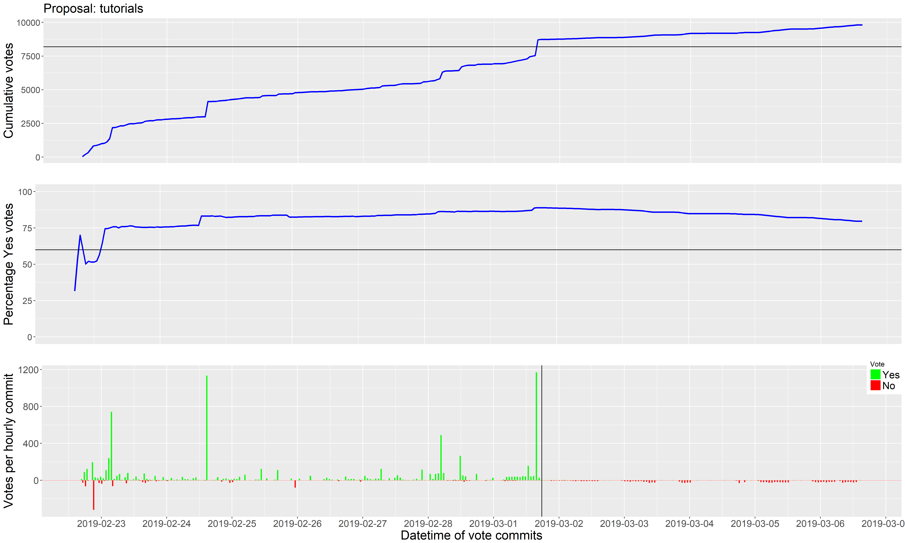
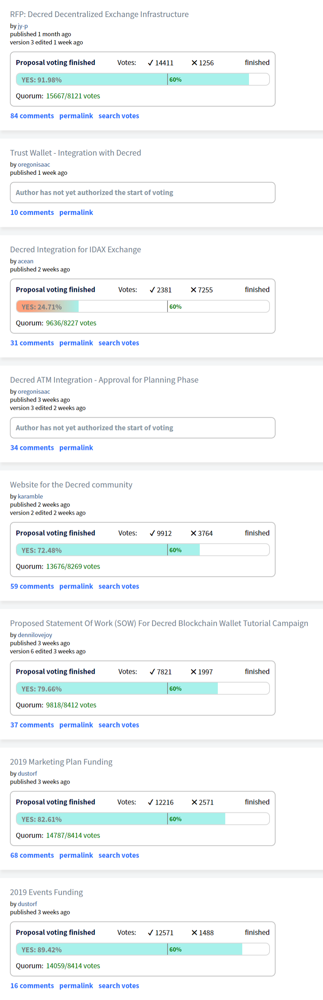

# Politeia Digest #12 - Mar 1 - Mar 14 2019

**Treasury balance: 608,755 DCR (approx +15,907 DCR/month) - $11.8 million (+$308k/month) based on $19.40 DCR price**

### New proposals

**[Trust Wallet - Integration with Decred](https://proposals.decred.org/proposals/2ababdea7da2b3d8312a773d477272135a883ed772ba99cdf31eddb5f261d571) - published Mar 5 by oregonisaac, last updated Mar 3 - 10 comments (+10)**

This proposal seeks funding to integrate DCR in Trust Wallet, a mobile wallet that allows users to store multiple cryptocurrencies. The proposal is submitted in draft form to solicit feedback which can be used to refine it before going to a vote. The integration work would have two components, 1) Trust Wallet team integrate DCR in the wallet ($1,200), 2) Decred team integrate Decred in Blockbook (which Trust Wallet uses to gather information about the state of the blockchain) and set up hosting for a Blockbook server ($2,100 in total). There are also $50/month ongoing fees associated with the Blockbook hosting and maintenance of the integration. One of the requirements before the proposal starts voting is to find Decred contractors who want to take on this work.

### Approved Proposals

**[RFP: Decred Decentralized Exchange Infrastructure](https://proposals.decred.org/proposals/5431da8ff4eda8cdbf8f4f2e08566ffa573464b97ef6d6bae78e749f27800d3a) - voting finished Mar 12 - 84 comments (+16)**
14,404 Yes votes, 1,255 No votes (92% Yes) - voter participation of 38.2%, support from 35% of tickets.

Before the vote started, @jy-p edited the proposal to clarify that CLI tools and GUI tools were to be completed in sequence, not in parallel.

*Recap: This proposal seeks to establish stakeholder support for building decentralized exchange infrastructure - "a new type of cryptocurrency-only decentralized exchange based on open source software that will allow cross-chain trading to occur directly between users, with minimal fees and a simple client-server architecture." If it is approved, this will trigger a Request for Proposals (RFP) process whereby interested developers are invited to put forward proposals for how they would go about the task and how much they would charge. This proposal sets a limit for the requested budget to between USD 100,000 and 250,000.*

**[Website for the Decred community](https://proposals.decred.org/proposals/fb8e6ca361c807168ea0bd6ddbfb7e05896b78f2576daf92f07315e6f8b5cd83) - voting finished Mar 5 - 59 comments (+1)**
9,912 Yes votes, 3,764 No votes (72.5% Yes) - voter participation of 33.4%, support from 24% of tickets.

The [decredcommunity.com](https://decredcommunity.com) site is now the [decredcommunity.org](https://decredcommunity.org) site, and is already being updated with the latest Decred publications (like the [Journal](https://decredcommunity.org/blog/decred-journal-february-2019)) and event listings.

*Recap: This proposal seeks funding to further develop a [prototype](https://decredcommunity.com) of a community hub website. This community website would record and present information about Decred content (articles, videos, podcasts), events and merchants. The proposal asks for $6,000 to cover the initial development of the prototype (already completed), and a further monthly budget of up to $700 to cover server costs and time spent maintaining and developing the site (charged at $35 per hour). This budget would be authorized for six months initially, another proposal would be made to extend it or if a larger budget was needed. Comments on the proposal express a range of views, most high-scoring comments are generally positive. @karamble has replied to many questions, in depth where required.*

**[2019 Marketing Plan Funding](https://proposals.decred.org/proposals/c84a76685e4437a15760033725044a15ad832f68f9d123eb837337060a09f86e) - voting finished Mar 1 - 68 comments (+0)**
12,145 Yes votes, 2,516 No votes (82.8% Yes) - voter participation of 35.8%, support from 30% of tickets.

@anshawblack's podcast is already in production and the wheels have started turning for the renewal of Decred Assembly, work on the website development has also been started and the localized community building efforts continue to gain momentum.

*Recap: This proposal requests a budget of $290k for marketing activities for the rest of 2019, divided into planned ($220k) and discretionary ($70k) spending buckets. Planned spending includes: $100k to support the growth of local communities and organizers in target markets; $65k for a round of updates to decred.org; $35k for a series of 10 Decred Assembly videos; $10k for 10 episodes of a new Decred in Depth podcast; and $5k each for a monthly newsletter and internship program. The proposed budget also includes $70k for discretionary spending on new initiatives during the year, with these decisions being made in the #marketing and #marketing_ops channels.*

**[2019 Events Funding](https://proposals.decred.org/proposals/d3e7f159b9680c059a3d4b398de2c8f6627108f28b7d61a3f10397acb4b5e509) - voting finished Mar 1 - 16 comments (+0)**
12,533 Yes votes, 1,448 No votes (89.6% Yes) - voter participation of 34.1%, support from 31% of tickets.

Some pitches for events are already being prepared.

*Recap: This proposal sets out a plan and budget for Decred's attendance at events in 2019. The total budget requested is $200k, with $150k to fund a Decred presence at one major event in each of North America, Europe and Asia (50k each). Examples of the kind of event being considered are given, but these are provisional as no agreements have yet been made. There is a further 50k budget requested to send individual speakers to relevant events, should they submit talks/sessions which are accepted by the organizers. @dustorf would be the final decision-maker on which events to attend, with input from the community.*

**[Proposed Statement Of Work (SOW) For Decred Blockchain Wallet Tutorial Campaign](https://proposals.decred.org/proposals/a3def199af812b796887f4eae22e11e45f112b50c2e17252c60ed190933ec14f) - voting finished Mar 1 - 37 comments (+0)**
7,769 Yes votes, 970 No votes (88.9% Yes) - voter participation of 21.3%, support from 19% of tickets.

@Denni Lovejoy has already shared a draft [script](https://docs.google.com/document/d/1Mzl__GnLO-QpVmhYc9xkxpHhNzfFBEgaSCNDUfuuOOk/edit) for the first tutorial video in #writers_room, and amended thoughtfully in response to feedback.

*Recap: This proposal requests a budget of $750 for the production of four tutorial videos in which @dennilovejoy will show and talk through processes like setting up a wallet in Decrediton, setting up a VSP account, and setting up a Politeia account. @dennilovejoy also included a [link](https://www.youtube.com/watch?v=HKwnEpFDN3Q&list=PLMBYy3lWO3Dmx-xHInb66OPcYQgmmcOEt) to similar videos they have produced about other projects, the videos produced for Decred if this proposal is approved would be hosted on a Decred channel and utilize Decred design assets.*

### Rejected proposals

**[Decred Integration for IDAX Exchange](https://proposals.decred.org/proposals/60adb9c0946482492889e85e9bce05c309665b3438dd85cb1a837df31fbf57fb) - voting finished Mar 6 - 31 comments (+6)**
2,381 Yes votes, 7,255 No votes (24.7% Yes) - voter participation of 23.5%, support from 6% of tickets.

*Recap: This proposal seeks 1,000 DCR to integrate Decred on the IDAX exchange and enable a BTC/DCR trading pair, as well as displaying a "Decred Project Introduction" on the IDAX Homepage and discounted fees for IDAX events. Comments suggest that the cost is too high and/or that the Treasury should not pay for exchange listings in general. @acean has been active in responding to comments. This proposal moved quickly to voting, progressing through the Politeia flow faster than any other proposal to date, by some margin.*

### Proposals under discussion

**[Decred ATM Integration - Approval for Planning Phase](https://proposals.decred.org/proposals/aea224a561cfed183f514a9ac700d68ba8a6c71dfbee71208fb9bff5fffab51d) - published Feb 18 by oregonisaac, last updated Feb 25 - 34 comments (+3)**

### Other News

From Mar 1 until Mar 15 (since the last issue of Politeia digest) there were:

- 1 new proposal submitted, 1 proposal started voting, 6 proposals finished voting.
- Proposals that have finished voting have an average (mean) turnout of 31%, with a total of 76,352 ticket votes being cast.
- 41 comments on Politeia proposals from 21 different users (public keys).
- 207 up/down votes on comments from 25 different voting users (public keys).
- 156 upvotes (80%) and 51 downvotes (20%).

Much of the work of preparing figures and statistics about Politeia activity has now been [automated](https://github.com/RichardRed0x/pi-research/tree/master/analysis), this includes proposal titles for Politeia Digest and the activity update above, texts for the [@pi_crumbs](https://twitter.com/pi_crumbs) twitter account, and the governance section of the [Decred Journal](https://xaur.github.io/decred-news/journal/201902.html).

A bug was detected whereby voters using the "vote trickling" feature of CLI could set the duration to extend beyond the end of the voting period and these late votes would still be reflected in the repository and on proposals.decred.org. I discovered this when making some voting charts and reported it to the Politeia developers. The tutorials proposal in particular saw many late votes which should not have been counted (see below, black vertical line on bottom pane marks end of voting period). There were also a smaller number of late votes on the other proposals to finish voting in this period.

The bug had been known for some time and a fix was awaiting deployment. Upon learning that late votes were now occurring in the production environment, the fix was deployed on Mar 13.

@lukebp developed the fix, and had this to say about the bug:

> There was a bug in politeiad that allowed votes to be cast even after the voting period had ended. The two clients (politeiavoter CLI and decrediton) would have prevented most people from taking advantage of this bug, but if you were trickling your votes in using the CLI and you set a duration that exceeded the end of the voting period, the CLI would have continued to trickle your votes in after the voting period had ended and politeiad would have included those votes in the proposal repository.
>
> The reassuring part about Politeia is that all of the data is publicly available and is periodically timestamped onto the Decred blockchain This means that anyone can pull the data down from github and cryptographically verify which votes were cast within the voting period (+/- 1 hour) and which ones were cast after the voting period had ended.

The numbers presented in this edition of Politeia Digest exclude the late votes, and as a consequence do not match the numbers displayed on the proposals.decred.org site.

### About this issue

Content for this edition was authored by @richardred, with contributions from @bee.

Also available on [medium](https://medium.com/@richardred/issue-11-feb-19-feb-28-2019-46befddb09fe).

### Snapshot

Proposals which have been active since the last issue if Politeia Digest was released.

