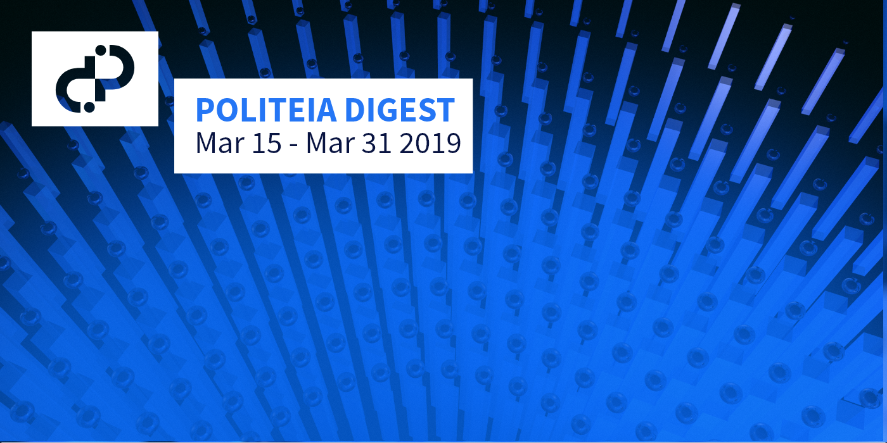
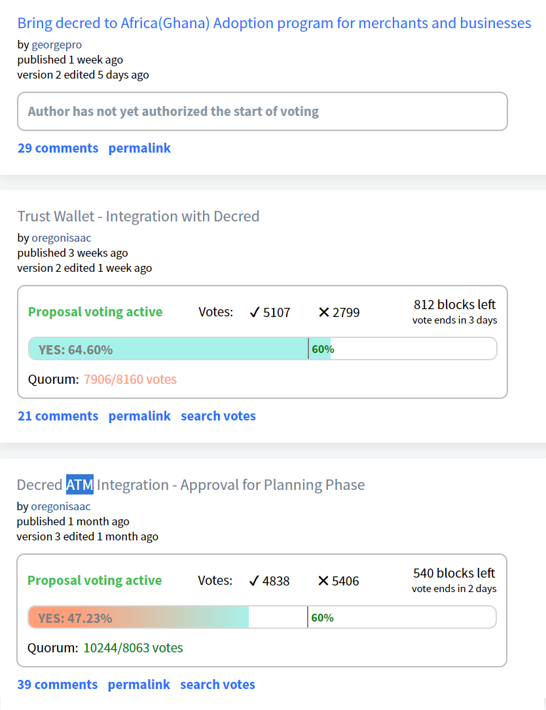

# Politeia Digest #13 - Mar 15 - Mar 31 2019

**Treasury balance: 604,035 DCR (approx +15,749 DCR/month) - $12.2 million (+$318k/month) based on $20.20 DCR price**

## New proposals

[**Bring decred to Africa(Ghana) Adoption program for merchants and businesses**](https://proposals.decred.org/proposals/dac06f18bfeb5f7667e56554774de3bb99151018ce16a64f5353bab45819763b)

Published Mar 20 by georgegro, last updated Mar 26 - 29 comments (+29)

This proposal seeks $41,054 to fund 3 months of outreach for a merchant adoption program in Ghana. The activities specified in the proposal include representing Decred at events (with a focus on Universities), creating and maintaining Decred Ghana social media accounts, running merchant adoption workshops and incentivizing participation with a program of tips and referral bonuses for merchants, and a photo contest.

High-scoring comments observe that @georgepro has facilitated a similar program for Dash in the past, and in their social media profiles identifies as an active Dash ambassador. The high-scoring comments also ask for additional information about the proposal, such as how the projected numbers were arrived at (e.g. "10 universities, 10 regions, 10000 target audiences") and how the quoted market research ("about 70% and 99% of the Ghanaian population has still not heard of Bitcoin and deCRED respectively") was conducted, identified a mention of SmartCash t-shirts in the budget, and took issue with the capitalization of deCRED employed in the original proposal text.

@georgepro has been active in answering questions on Politeia and discussing the proposal in chat, and also sharing [Medium post](https://medium.com/@aappiahpro1/how-i-pitch-decred-in-africa-62b9ee8da7e1) about how they pitch Decred in Africa. The update to the proposal changed deCRED to decred, and added social media accounts for the other 3 members of the team.

## Proposals open for voting

**[Trust Wallet - Integration with Decred](https://proposals.decred.org/proposals/2ababdea7da2b3d8312a773d477272135a883ed772ba99cdf31eddb5f261d571)**

Published Mar 5 by oregonisaac, voting started on Mar 26 - 21 comments (+11)

Latest voting figures: 5,063 Yes votes, 2,794 No votes (64.4% Yes) - voter participation of 19.2%, support from 12% of tickets.

This proposal has been edited once to clarify its positioning: "Note that no funds will be paid from the treasury unless the qualified resources decide to move forward with the work required. This is a proposal to signal the community would like to be integrated with Trust Wallet and not a guarantee of completion." The edit also adds an update that the Trust Wallet team are moving ahead with their part of the integration at no cost to Decred's Treasury. New comments on this proposal are generally supportive, @oregonisaac answered some [questions](https://proposals.decred.org/proposals/2ababdea7da2b3d8312a773d477272135a883ed772ba99cdf31eddb5f261d571/comments/17) from @bee and explained why they were green-lighting the proposal for voting although no qualified developers had yet stepped forward. 

> Recap: This proposal seeks funding to integrate DCR in Trust Wallet, a mobile wallet that allows users to store multiple cryptocurrencies. The integration work would have two components: 1) Trust Wallet team integrate DCR in the wallet ($1,200), 2) Decred team integrate Decred in Blockbook (which Trust Wallet uses to gather information about the state of the blockchain) and set up hosting for a Blockbook server ($2,100 in total). There are also $50/month ongoing fees associated with the Blockbook hosting and maintenance of the integration. One of the requirements before the proposal starts voting is to find Decred contractors who want to take on this work.

**[Decred ATM Integration - Approval for Planning Phase](https://proposals.decred.org/proposals/aea224a561cfed183f514a9ac700d68ba8a6c71dfbee71208fb9bff5fffab51d)**

Published Feb 18 by oregonisaac, voting started Mar 25 - 39 comments (+5).

Latest voting figures: 4,792 Yes votes, 5,365 No votes (47.2% Yes) - voter participation of 24.8%, support from 12% of tickets.

This proposal has been edited twice, with the edits being minor grammatical fixes.

Recap: @oregonisaac has been developing this proposal openly with feedback from the community for some time. It started with some [initial research](https://proposals.decred.org/proposals/bb7e19283d5c65fed598d5a2f4afcc2b5d2eab187b9cb84fc4304430f80b5ad1/comments/22) into ATM availability while the Bcash ATM integration [proposal](https://proposals.decred.org/proposals/bb7e19283d5c65fed598d5a2f4afcc2b5d2eab187b9cb84fc4304430f80b5ad1) was being discussed in November 2018. Since then, @oregonisaac has contacted major ATM providers and [shared](http://zer0byte.com/zeropastebin/?486d12a5d9413a9e#EOvkXU8zNW0fQZOEExMCr9Lf04BdK3hyuic7ZqyrVus=) [several](https://gist.github.com/oregonisaac/c25bac8e0ee9d4e99997b230885296eb) updates and drafts of a proposal which frames some integration work with General Bytes ATMs. The submitted proposal seeks approval to move forward with planning and a Request for Proposal process. If this initial proposal is approved, a further proposal would be submitted with details of a particular dev team that will complete the work, and their terms.

, middle pane shows approval % (black line marks 60% threshold), bottom pane shows yes/no votes per commit. Voting for the ATM proposal started ~24 hours before the Trust Wallet proposal.")

## Other News

From Mar 15 until Mar 31 there were:

- 1 new proposals submitted, 2 proposals started voting, 0 proposals finished voting.
- 45 comments on Politeia proposals from 18 different users (public keys).
- 124  up/down votes on comments from  16  different voting users (public keys).

@richardred pushed some initial [exploration](https://github.com/RichardRed0x/pi-research/blob/master/analysis/voting/early-voting-influence.md) of Politeia voting data to answer the question "Do early ticket votes influence the outcomes of Politeia proposals?" A summary:

* 17 completed proposal votes is not a large enough sample to reach any firm conclusions.

* around 55% tickets that have been eligible for at least 1 proposal have never voted. Of the tickets that have ever voted 43% *always* vote when they are eligible.
* within the voting period, 48% of all the votes are cast in the first 2.5 days, then there is a lull for 2.5 days where only 14% were cast, then a more active final interval where 38% were cast.
* 14 tickets that have voted on every one of the 17 proposals that has finished voting so far.
* proposals that are closer to the 60% approval threshold after 5 days see more voting in the final 2 days than proposals which are less controversial and already have a wide margin.

## About this issue

Content for this edition was authored by @richardred, with contributions from @bee.

Also available on [medium](https://medium.com/@richardred/issue-12-mar-1-mar-14-2019-bc77f1cfca8f).

## Snapshot

Proposals which have been active since the last issue if Politeia Digest was released.

