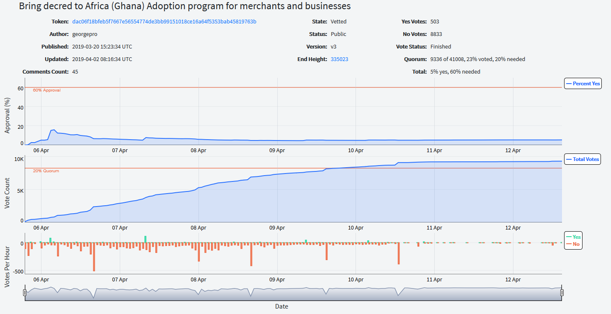
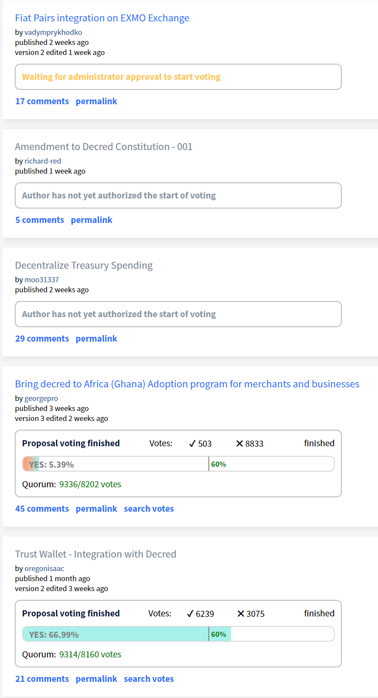

# Politeia Digest #14 - Apr 1 - Apr 16 2019

**Treasury balance: 612,256 DCR (approx +15,749 DCR/month) - $15 million (+$386k/month) based on $24.50 DCR price**

### New proposals

[**Decentralize Treasury Spending**](https://proposals.decred.org/proposals/c96290a2478d0a1916284438ea2c59a1215fe768a87648d04d45f6b7ecb82c3f)

Published Apr 2 by moo31337 - 29 comments (+29)

This proposal describes a way to decentralize control of Treasury spending by subjecting each month's outgoings to a stakeholder approval vote. Each month, Politeia's operators would process invoices from contractors to prepare a draft Treasury transaction for that month. Stakeholders would then vote on chain to approve or reject this transaction. The proposal observes that were the voting for these transactions to occur off chain, as with other Politeia proposals, the operators of the Politeia platform could manipulate the vote outcomes by not counting some of the votes - and therefore the decision was made to conduct the voting on Treasury spends on chain.

The proposal describes an initial formulation with a number of guardrails in place: 

* only Pi operators will be able to generate the draft transactions and put them up for a vote
* only one Treasury spend transaction can be approved per month
* Treasury transactions cannot spend more than the last month's accrued value +50%

The work to implement this system would be completed by Company 0 and other appropriately skilled contractors, at a projected cost of USD 200,000-250,000 and taking 9-12 months.

Top-scoring comments ask questions about the details of the implementation and how the 2 new proposed opcodes would work. Many of these questions concern the choice to vote on a single draft transaction each month, and ask what happens next if the stakeholders reject one of these monthly transactions. @moo31337 and @davecgh answered these questions with more detail on some aspects and explain that some aspects will be figured out later in the development process.

[**Fiat Pairs integration on EXMO Exchange**](https://proposals.decred.org/proposals/950e8149e594b01c010c1199233ab11e82c9da39174ba375d286dc72bb0a54d7)

Published Apr 2 by vadymprykhodko, last updated Apr  8 - 17 comments (+17)

This proposal requests $23,800 for the integration of DCR with BTC and fiat pairs (DCR/RUB, DCR/UAH) on the EXMO exchange. The requested budget would cover the integration of DCR, ongoing subsequent maintenance, promotional collaborations and a series of jointly organized meetups in Eastern Europe.

The proposal asks for $20,000 in BTC and $3,800 in DCR, but in [response](https://proposals.decred.org/proposals/950e8149e594b01c010c1199233ab11e82c9da39174ba375d286dc72bb0a54d7/comments/6) to a comment from @ryanzim, @vadymprykhodko states that the full amount can be paid in DCR. The work would be completed within two weeks of the proposal being approved.

@vadymprykhodko has edited the proposal once, edits include a clarification that additional DCR pairs can be added at no extra cost within 3 months, changing the delivery timeframe from 5 working days to two weeks, and a correction to the fiat pairs listed at the bottom of the proposal (DCR/UAH, instead of DCR/EUR). 

@vadymprykhodko has been active in responding to comments, most of the comments have been quite positive. Some comments asked whether other projects have paid for listings and how much, but @vadymprykhodko responded that this information cannot be disclosed.

 A pre-proposal post was submitted to [reddit](https://www.reddit.com/r/decred/comments/b0y9le/integration_on_exmo_exchange_new_fiat_pairs/).

**[Amendment to Decred Constitution - 001](https://proposals.decred.org/proposals/fd56bb79e0383f40fc2d92f4473634c59f1aa0abda7aabe29079216202c83114) **

Published Apr 5 by richard-red - 5 comments (+5)

An amendment to the Decred constitution is proposed which updates the document to remove out-dated sections   (e.g. Decred Assembly and Councils) and add information about aspects which are new since the constitution was written originally (e.g. Politeia). The proposal also seeks to define the constitution's purpose (a document which describes the social contract between users and the project but which is secondary to the network's consensus rules) and establish the method through which it can be amended in future (a successful Politeia proposal).

Comments on the proposal ask whether aspects of the constitution might constrain stakeholders' decision-making, @richard-red responded that in his view it would not. 

### Approved proposal

**[Trust Wallet - Integration with Decred](https://proposals.decred.org/proposals/2ababdea7da2b3d8312a773d477272135a883ed772ba99cdf31eddb5f261d571)**

21 comments (+0). Voting finished Apr 3: 6,239 Yes votes, 3,075 No votes (67% Yes) - voter participation of 22.8%, support from 15% of tickets.

### Rejected proposals

**[Decred ATM Integration - Approval for Planning Phase](https://proposals.decred.org/proposals/aea224a561cfed183f514a9ac700d68ba8a6c71dfbee71208fb9bff5fffab51d)**

39 comments (+0). Voting finished Apr 2: 6,696 Yes votes, 6,051 No votes (52.5% Yes) - voter participation of 31.6%, support from 16% of tickets.

This is the first proposal to be rejected despite having support from the majority of voters (greater than 50% but not the required 60%). In a [discussion](https://matrix.to/#/!MIGqWXfLFBwhipPKYL:decred.org/$15542882616188dHEHP:decred.org?via=decred.org&via=matrix.org&via=zettaport.com) in the #proposals channel several community members stated that they think it would be fair enough to submit an amended version of this proposal, and @oregonisaac stated that they are considering doing so. 

**[Bring decred to Africa (Ghana) Adoption program for merchants and businesses](https://proposals.decred.org/proposals/dac06f18bfeb5f7667e56554774de3bb99151018ce16a64f5353bab45819763b)** 

45 comments (+16). Voting finished Apr 12: 503 Yes votes, 8,833 No votes (5.4% Yes) - voter participation of 22.8%, support from 1% of tickets.

### Other News

Live [voting charts](https://alpha.dcrdata.org/proposals) for Politeia proposals have been added to the alpha version of dcrdata. Below is the [chart](https://alpha.dcrdata.org/proposal/4) for @georgepro's Bring Decred to Ghana proposal. The latest charts for proposals that are open for voting can be obtained from dcrdata any time.

A round of improvements is being deployed on proposals.decred.org on Apr 17. These changes include:

* Performance improvements
* A highlighted view of the diff between an old version of a proposal and the previous version has been added, when viewing versions of a proposal in the "edited" drop-down menu.
* A change to the default sort order for comments, making Top sorting (by score) the default (previously New was default). 

The Politeia developers have been working mostly on the integration of the [contractor management system](https://github.com/decred/contractor-mgmt) with Politeia. 

As part of the [Decred Open Source Research program](https://proposals.decred.org/proposals/5d9cfb07aefb338ba1b74f97de16ee651beabc851c7f2b5f790bd88aea23b3cb) ([Governance Models Research](https://proposals.decred.org/proposals/5d9cfb07aefb338ba1b74f97de16ee651beabc851c7f2b5f790bd88aea23b3cb/comments/14) strand), proposal data for Decred (plus Dash and Aragon) has been [shared](https://github.com/RichardRed0x/crypto-governance-research/tree/master/governance-proposals), along with a short [write-up](https://github.com/RichardRed0x/crypto-governance-research/blob/master/governance-proposals/proposal-data-notes.md) explaining the data. With 20 proposals finished voting, average (mean) ticket participation is 30.4%.

From Apr  1 until Apr 16 on Politeia there were:

- 3 new proposals submitted, 1 proposals started voting, 3 proposals finished voting.
- Proposals that have finished voting have an average (mean) turnout of 25.7%, with a total of 31,397 ticket votes being cast.
- 67 comments on Politeia proposals from 22 different users (public keys).
- 184  up/down votes on comments from  24  different voting users (public keys).
- 169 upvotes (90%) and 15 downvotes (10%).

## About this issue

Content for this edition was authored by @richardred, with contributions from @bee.

Also available on [medium](https://medium.com/politeia-digest/issue-13-mar-15-mar-31-2019-fe4cb1507d1b).

## Snapshot

Proposals which have been active since the last issue if Politeia Digest was released.

