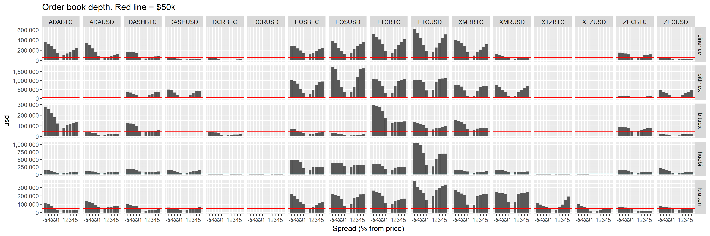

# Politeia Digest #21 - August 13-31 2019

**Treasury balance: 634,217 DCR (approx +14,621 DCR/month) - $14.6 million (+$336k/month) based on $23 DCR price**

## New proposals

**[Tantra Labs - Market Making Proposal](https://proposals.decred.org/proposals/82ce113827140caaaf8b5779ab30402d3ed39f1911fdd2e8fa64cf0dc9e09ecb)**
Published Aug 28 by tantralabs last updated Aug 28 - 33 comments (+33)
Published Aug 28 by tantralabs, last updated Aug 28 - 4 comments ()

This proposal from Tantra Labs offers to provide market making services for DCR pairs without charging for that service (Tantra would still bill for reimbursement of trading fees and the cost of borrowing inventory). This offer is positioned as Tantra doing the Decred ecosystem a favor, and possibly sustaining a loss in the process.

Tantra Labs is a subsidiary of Block26 and is affiliated with Blockhead Capital - both long time supporters of Decred, according to the proposal. The only text on Tantra Labs' [website](https://tantralabs.io/) states that "Tantra is an algorithmic development platform and proprietary trading desk built for generating alpha from Bitcoin trading strategies." In their proposal they claim to have a proprietary trading system which has outperformed BTC by 60% over the last 8 months. 

The liquidity on offer is $30k each side, at a looser spread than the other offers. It is [not clear](https://proposals.decred.org/proposals/82ce113827140caaaf8b5779ab30402d3ed39f1911fdd2e8fa64cf0dc9e09ecb/comments/8) at time of writing whether Tantra would cover 6 or 7 pairs. The proposed setup time is longer for Tantra than the other proposals (90 vs 60 days respectively). At the maximum level of fee reimbursement, the Tantra proposal would cost around $17k/month, considerably (32%/50%) less than the other proposals, but not free.

Discussion has focused on whether the proposed offer is realistically achievable, with scepticism being expressed about Tantra's capacity to deliver what they propose. @jz [recounted](https://proposals.decred.org/proposals/82ce113827140caaaf8b5779ab30402d3ed39f1911fdd2e8fa64cf0dc9e09ecb) some claims from i2 Trading in the #proposals channel, stating that Tantra had approached them for investment but did not allow any transparency on their technology or trading history. 

In response to questions, Tantra have [listed](https://proposals.decred.org/proposals/82ce113827140caaaf8b5779ab30402d3ed39f1911fdd2e8fa64cf0dc9e09ecb/comments/5) Bitmex and Deribit BTC derivatives markets where they have been active as market makers. It has been pointed out that these are very different and much more liquid than the DCR markets which would be covered as part of this proposal.

In response to the concern that Tantra Labs are relatively unknown as market makers and within the Decred ecosystem, they have published a [Medium post](https://medium.com/@TantraLabs/introducing-tantra-labs-e459a724ab42) introducing the organization. Tantra have been active on Politeia answering some of the community's questions.

**[Incrementalist Proposal as Small Step to Solving Decred's Liquidity Problem](https://proposals.decred.org/proposals/c9604f7879e4b2cd4f2582d238a7ccea210005c63481bec1ddae44ff93e1340f)**
Published Aug 31 by betterfuture - 5 comments (+5)

This proposal suggests offering a "standard MM incentive fee"  to any MM that signs up and provides a certain level of liquidity within specified parameters. The proposal suggests that market making roles be assigned on a first come first served basis, as long as the MM which claims a market is up and running within 24 hours. An assortment of penalties are proposed for punishing MMs who do not abide by the rules. 

The proposal nominates @jz or his designee as the person who would check that MMs had been operating in line with the terms of the program - and suggests that he be paid $2,000/month for this. @jz has [responded](https://proposals.decred.org/proposals/c9604f7879e4b2cd4f2582d238a7ccea210005c63481bec1ddae44ff93e1340f/comments/5) to say that he has never been paid by the treasury for his services and does not intend to start billing for work. @jz also expresses a lack of enthusiasm for spearheading this initiative, and scepticism that quality candidates will be willing to jump through the hoops the proposal describes to earn the Treasury's business. 

## Approved proposals

**[RFP: Decred Designated Market Maker](https://proposals.decred.org/proposals/30822c16533890abc6e243eb6d12264b207c3923c14af42cd9b883e71c7003cd)**

Voting finished Aug 22 - 89 comments (+61)

Final voting figures: 14,074 Yes votes (87.1%), 2,093 No votes - voter participation of 39.1%, support from 34% of tickets.

With 89 comments, this was the most actively discussed proposal on Politeia so far (previously this was the DEX RFP proposal with 84 comments).

The top [comment](https://proposals.decred.org/proposals/30822c16533890abc6e243eb6d12264b207c3923c14af42cd9b883e71c7003cd/comments/29) from @maxbronstein gives an account of the process of bringing the market maker proposals to Politeia, and argues in favor of approving one of these proposals. These arguments focus on the issue of low liquidity as a barrier to institutional investment and as a weakness for a Store of Value. Most of the other top comments are positive on moving forward with the RFP process but not necessarily persuaded by any of the available offers. @solar's [comment](https://proposals.decred.org/proposals/30822c16533890abc6e243eb6d12264b207c3923c14af42cd9b883e71c7003cd/comments/16) on this proposal are notably more negative about the need for market makers paid for by the Treasury than the others which have scored well. There are other comments with high scores which suggest to treat this as an experiment and start with a relatively small provision and cost. @jz responded to many questions on the RFP proposal ([not](https://proposals.decred.org/proposals/30822c16533890abc6e243eb6d12264b207c3923c14af42cd9b883e71c7003cd/comments/58) [least](https://proposals.decred.org/proposals/30822c16533890abc6e243eb6d12264b207c3923c14af42cd9b883e71c7003cd/comments/60) [from](https://proposals.decred.org/proposals/30822c16533890abc6e243eb6d12264b207c3923c14af42cd9b883e71c7003cd/comments/61) [bee](https://proposals.decred.org/proposals/30822c16533890abc6e243eb6d12264b207c3923c14af42cd9b883e71c7003cd/comments/59)) and in the #proposals channel, providing an education in market making following the Socratic method.

**[Decentralized Exchange Development](https://proposals.decred.org/proposals/417607aaedff2942ff3701cdb4eff76637eca4ed7f7ba816e5c0bd2e971602e1)**

Voting finished Aug 19 - 16 comments (+5)

Final voting figures: 14,914 Yes votes (89.8%), 1,693 No votes - voter participation of 40.8%, support from 36% of tickets.

@bee showed up with some late [questions](https://proposals.decred.org/proposals/417607aaedff2942ff3701cdb4eff76637eca4ed7f7ba816e5c0bd2e971602e1/comments/14), and got some good answers from @chappjc shortly before voting ended.

**[TinyDecred: A Python Toolkit for Decred](https://proposals.decred.org/proposals/20e967dad9e7398901decf3cfe0acf4e0853f6558a62607265c63fe791b8b124) - voting finished Aug 13 - 21 comments (+7)**
12,837 Yes votes, 786 No votes (94.2% Yes) - voter participation of 33.2%, support from 31% of tickets.

## Market Makers Part 2: The Market-Makening

Altonomy dropped out of the running, editing the title of their [proposal](https://proposals.decred.org/proposals/772d083fef79fa2e443d8424b353deadc3af69c8d8764e473cb200f98f356c60) to "Proposal Withdraw" and editing the text to say "Sorry, due to our technical capacity, we decided to withdraw this proposal." This sparked some discussion about whether the titles of live proposals should be editable, with the general consensus being that once the proposal goes live the owner should not be able to edit the title.

The proposals from Grapefruit and i2 were edited on Aug 26/27 to amend and clarify the terms of their offers - both of these proposals were authorized to start voting on Aug 27.

**[Grapefruit Trading Market Making proposal](https://proposals.decred.org/proposals/4becbe00bd5ae93312426a8cf5eeef78050f5b8b8430b45f3ea54ca89213f82b)**
Published Aug  7 by grapefruittrading, last updated Aug 26 - 40 comments (+10)

Published Aug 7 by grapefruittrading, last updated Aug 26 - 39 comments ()

Grapefruit opted to go with the less expensive and looser of their 2 offers, [stating](https://matrix.to/#/!MIGqWXfLFBwhipPKYL:decred.org/$15668424562388499ecNYR:matrix.org) in #proposals that their reason for going forward with this option rather than the more expensive one was that they thought the community is looking for a more affordable option, and that it was also their preferred option.

The Grapefruit offer is $30k each side on 4 pairs at equivalent of 2% spread (flexible, could be up to 4% away from the price on either the buy or sell side). The monthly fee would be $28,000, trading fees would be covered by Grapefruit, and interest on the loaned inventory would cost around $2,900 per month, for a total maximum monthly cost of $30,900.

**[i2 Trading: DCR Market Making](https://proposals.decred.org/proposals/2eb7ddb29f151691ba14ac8c54d53f6692c1f5e8fe06244edf7d3c33fb440bd9)**
Published Aug  7 by i2trading, last updated Aug 27 - 55 comments (+8)
Published Aug 7 by i2trading, last updated Aug 27 - 55 comments ()

i2 amended their offer to reduce the monthly fee from $40,000 to $35,000 and reducing the cap on trading fees charged from $20k to $10k - while loosening the spread of the closest $10k from 1% to 1.5% and loosening the average market spread from 0.3% to 0.5% on BTC pairs and 0.75% on USD pairs. i2 also edited the proposal to say that they will provide read-only keys to a Decred representative for 2 hours per week, so that this designated community member can verify i2's market activity.

The final version of the proposal includes a line detailing the max total monthly costs: 45k USD, .213 BTC, 150 DCR, and 1600 USDT (All invoicing will be converted into USD and paid in DCR). This works out around $53,200/month maximum cost.

The top [comment](https://proposals.decred.org/proposals/2eb7ddb29f151691ba14ac8c54d53f6692c1f5e8fe06244edf7d3c33fb440bd9/comments/31) on the i2 proposal is from @muststopmurad, endorsing i2's reliability as a cryptocurrency dealer and support of the Decred ecosystem.

### Community produced market maker resources

In addition to the in depth answers on Politeia, members of the Decred community have produced various resources which aim to inform the stakeholder community and facilitate the learning required to reach a collectively intelligent decision.

|                            | Tantra Labs                 | i2 Trading                  | Grapefruit            |
| -------------------------- | --------------------------- | --------------------------- | --------------------- |
| Liquidity (each side)      | $30k                        | $50k                        | $30k                  |
| Pairs                      | 6                           | 6                           | 4                     |
| Total liquidity (e/s)      | $180k                       | $300k                       | $120k                 |
| Spread                     | $30k Layered +/-3%          | $10k/1.5%,$30k/2%,$50k/4%   | $30k 2% (flexible)    |
| Uptime                     | 90%                         | 90%                         | 80%                   |
| Fees                       | $0k/m                       | $35k/m                      | $28k/m                |
| Inventory                  | 30k DCR                     | 30k DCR                     | 12k DCR               |
| Interest (6 months)        | $40.5k                      | $49k                        | $17k                  |
| Trading fees               | Treasury (max $10k/month)   | Treasury (max $10k/month)   | Included in price     |
| Max 6 month cost           | $100.5k                     | $319k                       | $185k                 |
| Max Monthly cost           | $17k                        | $53k                        | $31k                  |
| $ of liquidity per $ spent | $1.80 (at max trading fees) | $0.94 (at max trading fees) | $0.65 (includes fees) |
| Max setup time             | 90 days                     | 60 days                     | 60 days               |
| Transparency               | API read access, open tools | API read access, reports    | Monthly reports       |

* @richardred has been maintaining this table and some notes about the differences between the offers (now in the [decredcommunity/proposals](https://github.com/decredcommunity/proposals/blob/master/market-makers/comparison.md) repository). At current prices, these proposals would consume between 5-16% of Treasury inflow.

* @bee has written up a comprehensive [overview](https://github.com/decredcommunity/proposals/blob/master/market-makers/arguments.md) of the discussion in relation to specific questions and arguments, and also a detailed [dissection](https://github.com/xaur/writings/blob/master/20190822-dissection-market-makers-for-decred.md) of the subject, introducing relevant terms and presenting an overview of the key considerations.
* @exitus has produced a [video overview](https://www.youtube.com/watch?v=BKSMA-eanoY) of the proposals.
* @richardred has collected data on the order books of 16 different pairs across 5 exchanges, and [written up some initial analysis (with graphs)](https://github.com/RichardRed0x/exchange-data) that compares DCR liquidity to other assets, in an effort to understand the current situation and how much difference $30-50k of additional liquidity would make to the order books. Summary is that DCR order books are relatively thin, especially on the sell side. The proposed additional liquidity would double or more the depth of orderbooks within 5% spread for most DCR pairs. Even the maximum proposed $50k each side would still leave DCR with thinner order books than the other assets considered.
* an index of all notable documents and discussions related to market makers is maintained [here](https://github.com/decredcommunity/proposals/blob/master/market-makers/index.md)

## Other News

From Aug 13 until Aug 31 there were:

- 2 new proposals submitted, 1 proposals started voting, 3 proposals finished voting.
- Proposals that have finished voting have an average (mean) turnout of 37.7%, with a total of 46,397 ticket votes being cast.
- 130 comments on Politeia proposals from 12 different users.
- 557  up/down votes on comments from  12  different voting users.

## About this issue

Snapshot for this issue based on this [commit](https://github.com/decred-proposals/mainnet/commit/422610a567e4043989145a66df6ad94be507243f).

Content for this edition was authored by @richardred with fixes by @bee

Image credit: @30000fps.

Also available on [medium]({}).
