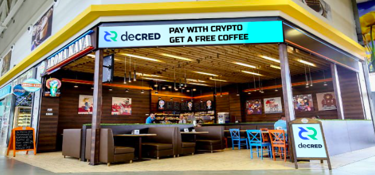

# Politeia Digest #23 - Sep 13-Oct 9 2019

**Treasury balance: 644,122 (approx +14,476 DCR/month) - $11 million (+$248k/month) based on $17.12 DCR price**

## New proposals

**[DCR Comic: a visual guide to Decred](https://proposals.decred.org/proposals/2ef74fa5f0b558442cb85b1235c8c551a51ff5d8b8de44dead48b8b59c8fc1de)**

Published Oct 7 by pablito | 12 comments (+12)

This proposal requests $10,800 for the production of 9 comics about Decred, $3,600 for 3 comics which have [already](https://raw.githubusercontent.com/pLabarta/dcrwebcomic/master/01%20-%20The%20way%20of%20the%20Contractor/Images/en/comic1.png) [been](https://raw.githubusercontent.com/pLabarta/dcrwebcomic/master/02%20-%20Proof-of-Work%2C%20explained/Images/en/comic2.png) [produced](https://raw.githubusercontent.com/pLabarta/dcrwebcomic/master/03%20-%20DEX/Images/en/comic3.png) and $7,200 for a further 6. This puts the cost of each comic at $1,200. The proposal gives a breakdown of the roughly 40 hours that go into producing each comic. The comics each explain some aspect of Decred.

@pablito and @nachito have shared their work in chat channels as they have produced it, and received generally positive feedback. The comics and related assets are shared in a GitHub [repository](https://github.com/pLabarta/dcrwebcomic), and there are plans to publish the comics on a range of social media platforms. The authors have also made some other contributions, listed in the proposal, including a post about setting up a full node.

Comments on the proposal are so far generally positive about the comics themselves. Many commenters are not sure if the cost is justified and point out that the completed comics are not yet being actively shared, so it is not clear how well they will be received.

**[Amin Rafiee: Decred Hackers Congress](https://proposals.decred.org/proposals/42b16d2741d58903963d8535e04017bbc3a8193391a83b305f44c082b62e3aa8)**

Published Oct 4 by evok3d | 3 comments (+3)

This proposal requests $2,050 for a presentation at The Hackers Congress. The proposal was submitted shortly before the presentation was delivered; a video of the presentation can be found [here](https://www.youtube.com/watch?v=TYkIyUaRG0s&t=4h02m11s), the part about Decred starts at [4:26:06](https://www.youtube.com/watch?v=TYkIyUaRG0s&t=4h26m06s)). A breakdown of costs incurred is included, including travel, accommodation and €2,000 for personal and professional costs; the request is for 50% of the total costs.

@evok3d has made some previous contributions to the project and these are listed in the proposal. A future event and article about the presentation are planned.

Most of the discussion of this proposal has occurred in the proposals channel, and the proposal has prompted a deeper discussion of if and when people should be paid to attend events and present about Decred. Many community members feel that it is not appropriate to pay people who mention Decred in a more general talk, as this comes across as paying for endorsements.

**[DECRED OFFLINE ECOSYSTEM BUILDING AND FIAT BACKING](https://proposals.decred.org/proposals/1b4b72fa08792b6500ef770546c24ee751c2b0fee2975db769722524a2754829)**

Published Oct 4 by cryptoagents | 17 comments (+17)

This proposal requests $283,000 to build a "food-points bonus and payment system in Europe countries" and to build 15 Decred branded coffee shops. 90% of the profit from the coffee shops would be paid back to the Decred stakeholders or Treasury. The proposal also offers to build a simple online panel for voting on how the funds should be used, which is still to be determined. The coffee points would be in Ukraine, and this is presumably the main target market for the food-points system.

The food-points system is best described in the proposal's own words:

> Presented by application and based on Decred coins obtaining and holding bonus systems will motivate millions of customers to purchase via automated high-price algorithm Decred coins and hold them to receive gifts and discounts in popular food networks and coffee points, making Decred coin volume and price become backed by food industry customers.

The food reward points system involves customers purchasing "Decred Bonus Points presented by DCR", and bonus points can be used to generate a payment QR code that will discount the purchase of a cup of coffee, increasing the discount rate each time up to a maximum of 10% discount. It is not clear in the proposal whether "Decred Bonus Points" are distinct from DCR, and whether the customers receive both DCR and "bonus points".

The goals of the proposal are summarized in this sentence:

> Being interested in two major goals - to back up and grow Decred fund pool and increase Decred adoption on a wide market and increase Decred brand awareness, the choice of a food points franchise to delegate funds to forces to choose already mass adopted network with a low opening cost, highly automated processes and low royalties, as well as speed of opening and possibility to choose a right place (near business centres, universities, etc).

There are also mockups of what the Decred branding of these coffee points might look like.

Comments express appreciation for the entertainment value of the proposal but there are as yet none that suggest approving it.

## Approved Proposals

**[Research & Publication of On-Chain DCRUSD & DCRBTC Indicators](https://proposals.decred.org/proposals/f0d1bd7447182328b44c691de88cb660b63df17f1f3a94990af19acea57c09bb)**

Voting finished Oct 2 | 42 comments (+21). Final voting figures: 9,050 Yes votes, 1,857 No votes (83% Yes) - voter participation of 26.6%, support from 22% of tickets.

## Rejected Proposals

**[DECRED Events & Meetups in the CIS in 2019-2020](https://proposals.decred.org/proposals/fdd68c87961549750adf29e178128210cb310294080211cf6a35792aa1bb7f63)**

Voting finished Oct 2 | 18 comments (+13). Final voting figures: 393 Yes votes, 9,685 No votes (3.9% Yes) - voter participation of 24.6%, support from 1% of tickets.

## Abandoned Proposals

**[Incrementalist Proposal as Small Step to Solving Decred's Liquidity Problem](https://proposals.decred.org/proposals/c9604f7879e4b2cd4f2582d238a7ccea210005c63481bec1ddae44ff93e1340f)**

Published Aug 31 by betterfuture | last updated Sep 1 | 15 comments (+0)

## Other News

Politeia's redesign is live on [testnet](https://test-proposals.decred.org/) and feedback, testing is welcome. Most of the reported issues have already been addressed. The database will soon be reset for another round of testing focusing on the signup and onboarding process. If that goes smoothly the redesign should be making its way to the live site soon.

DCP0005 (the [proposal](https://proposals.decred.org/proposals/0a1ff846ec271184ea4e3a921a3ccd8d478f69948b984445ee1852f272d54c58) to introduce the block header commitments) is undergoing final [review](https://github.com/decred/dcps/pull/13) and should soon be [merged](https://github.com/decred/dcps/blob/master/dcp-0005/dcp-0005.mediawiki).

From Sep 13 until Oct 9 there were:

- 3 new proposals submitted, 2 proposals started voting, 2 proposals finished voting.
- Proposals that have finished voting have an average (mean) turnout of 25.6%, with a total of 20,985 ticket votes being cast.
- 66 comments on Politeia proposals from 19 different users.
- 156 up/down votes on comments from 18 different voting users.
- 134 upvotes (86%) and 22 downvotes (14%).

## Politeia Digest has a new home!

I created [blockcommons.red](https://www.blockcommons.red/) as an alternative to Medium and GitHub for publishing and hosting things I produce. The site hosts Politeia Digest and also most of the outputs of the Decred Open Source Research program, plus some other articles I have written.

It is an open [source](https://github.com/block-commons/block-commons) static site built with Hugo (with some help from @jholdstock on the basics and @sænder on the aesthetics), and it is relatively easy to add or manage content through GitHub. It is open for contributions that fit with the current projects and themes (in particular [Politeia Decision Support](https://www.blockcommons.red/project/politeia-decision-support/) and [Crypto Governance Research](https://www.blockcommons.red/crypto-governance-research/overviews/)). I am also looking at setting up another site for tracking research outputs and resources relevant to the project more broadly - let me know if you're interested in contributing to that please.

## About this issue

Snapshot for this issue based on this [commit](https://github.com/decred-proposals/mainnet/commit/af417166898d0e444b67de2f8ed18d839f1709aa).

Content for this edition was authored by @richardred with fixes from @bee and @s\_ben.

Image credit: @sænder

Also available on [medium]({}).
