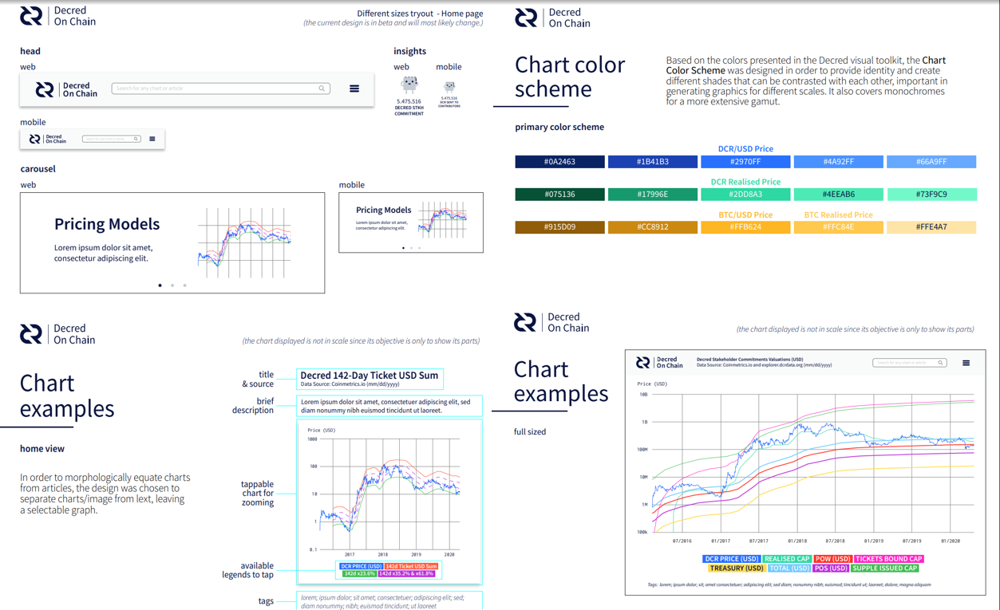

# Politeia Digest #31 - Apr 16 - May 22 2020

**Treasury balance: 627,750 DCR (approx +13,000 DCR/month) - $8.9 million (+$183k/month) based on $14.10 DCR price**

## New proposals

**[DCR On-Chain Research: Phase 2](https://proposals.decred.org/proposals/68a32c1f36d24a17e5eb69d6d1b6adb587ca45c9c7e64e85c353e7dba7fca545)**

Published May 13 by permabullnino | 21 comments

The second research proposal from @permabullnino (first [proposal](https://proposals.decred.org/proposals/f0d1bd7447182328b44c691de88cb660b63df17f1f3a94990af19acea57c09bb)) requests $16,000 to cover 8-10 months of work, continuing the themes from the first phase but with more varied outputs. Long-form posts will be reduced in response to feedback from phase 1, with more medium-length posts and a monthly newsletter that provides updates produced with already established tools. @permabullnino reports an average monthly spend from phase 1 of $1,900, and projects a monthly spend of $1,600-$2,000 for phase 2. @permabullnino also reports that he has started automating the deployment of his existing tools and offers a [repository](https://github.com/permabullnino/nino_on_chain) where these can be found.

Comments are generally supportive, although @goodriver makes a verbose argument against the proposal across a number of lengthy comments, in a back and forth with @permabullnino and @checkmate that also spills over to the Decred OnChain proposal.

**[Decred OnChain - A Research and Charting Resource](https://proposals.decred.org/proposals/023091831f6434f743f3a317aacf8c73a123b30d758db854a2f294c0b3341bcc)**

Published May 17 by checkmate | 42 comments

This proposal requests $7,800 to develop an MVP Decred charting site, the MVP would have 5 live chart types with associated explanatory texts. The selection of charts is based on @permabullnino and @checkmate's research, and the charts would be linked to their papers on the relevant subjects. Also on the team are @nachito and @pablito (of DCRComic, working on design), @svitekpavel (developer) and @stan (UX & Product). Design of the site has already begun, and some wireframes and other assets are included in the proposal.

The proposal aims for 12 week delivery, and the budget would be split between design ($3k) and development ($4.8k). The work on specifying the charts would be completed as part of @checkmate's already approved [proposal](https://proposals.decred.org/proposals/a677e236cb2e0fdd485980cd5d789e668d00fdc5235d01e7345d2195b8679066), which has a budget of $2.5k for this kind of activity (although originally intended to be integrated in dcrdata).

This proposal enjoyed a remarkably positive and highly upvoted comment from @praxis, which praised it for its competent team, low asking price and developed concept. There were positive comments from some other well known contributors, and some negative comments from less familiar personas.

**[TV Marketing For Decred (DCR)](https://proposals.decred.org/proposals/9eaafc20f206776e38642e272233390f351c5562c3835369a558cc7d7e341018)**

Published May 18 by w3bt | 11 comments

This proposal offers to produce either a 2 ($39K) or 6 ($110K) part series of 7-12 minute interviews, to be broadcast by FMW TV's broadcast network. The proposal contains a lot of numbers, maybe more than any other proposal, but it is not clear how relevant some of them are. Claims like "TV exposure has the potential to increase... token price +901%" have been identified as raising red flags by several commenters, and questions have been asked about whether the high profile TV channel names being dropped are reflective of what would be delivered. So far there are no responses from the proposal owner.

**[CoinStory - The History and Evolution of Cryptocurrencies (Book)](https://proposals.decred.org/proposals/4affceb07f5b8126366e8b73ed3d164ebc010bc6fefba19375c4c2e2b252beb0)**

Published May 18 by spider333 | last edited May 20 | 19 comments

In this proposal David Stancell requests $1,000 USD as sponsorship of a book publication. The book is about the history of cryptocurrencies and will feature a limited mention of Decred in the altcoins section. If the proposal is approved the Decred logo and link would appear as a sponsor of the book on its website. David is also seeking funding from other sources, and estimates that he will need around $8,000 to publish the book. In [response](https://proposals.decred.org/proposals/4affceb07f5b8126366e8b73ed3d164ebc010bc6fefba19375c4c2e2b252beb0/comments/15) to a comment David suggested the book may be open sourced in future, but this was not part of the immediate plan. Two early chapters of the book are available on its [website](https://coinstory.tech/).

Early comments asked about David's views on Decred and whether he has looked into the project, and how prominently it will feature in the book and on the website. The initial version of the proposal did not include any amount or terms but it was quickly edited to add these. David has been responding to questions and is [considering](https://proposals.decred.org/proposals/4affceb07f5b8126366e8b73ed3d164ebc010bc6fefba19375c4c2e2b252beb0/comments/16) dropping the ask to $500, and also looking at which other aspects of Decred might be relevant for the book as he learns more about the project.

**[Decred Latam Marketing and Events Proposal 2](https://proposals.decred.org/proposals/3c02b677462d6d22d61bf786798e975b38df7a203c2467429d4ec91f75ef0c40)**

Published May 19 by 3lian | last edited May 20 | 17 comments

This proposal requests $46,000 to continue (previous [proposal](https://proposals.decred.org/proposals/3c02b677462d6d22d61bf786798e975b38df7a203c2467429d4ec91f75ef0c40)) the pandemic-attenuated activities of the Latam team for 6 months. It provides an in depth account of the concluding phase, which saw all events being cancelled. The Latam team have paid deposits up front for some events, which will be carried over to whenever the event can resume. The proposal reports spending of $82,072.38, which is $10K over the first proposal's budget of $72K. A version of the proposal on [GitHub](https://gist.github.com/3lian/4f33c0133d5fb4dc3db6114fa32bc13e) has tables with detailed breakdowns of spending on the proposal.

The Latam team have shifted focus to online activities, and for the next phase plan to focus on the creation of a number of Spanish media products: a monthly translation of Decred Journal and video version, 2 monthly #HablemosDecred community calls, 2 monthly crypto 101 shows and 1 monthly ad-hoc panel. Other areas of focus going forward are public relations and enhancing Decred's presence in Spanish crypto media, as well as developer recruitment, academic awareness and user support.

## Rejected proposals

**[DCR Comic: a visual guide to Decred - Season 2](https://proposals.decred.org/proposals/2f08f8518bc7672069a10ac6461fd9ab341d4a9e4c343fd4a7ec426250f3896f)**

Published 23 Mar by pablito | edited 6 Apr | 22 comments (+1)

Final voting figures: 3,926 Yes votes, 4,009 No votes (49.5% Yes) - voter participation of 19.2%.

**[Decred Daily Initiatives Proposal](https://proposals.decred.org/proposals/7d42c6f4bf3059b64789185af615c1df97cb61a379425933be5ff01d074ed4d5)**

Published 26 Mar by coin4 | edited 4 Apr | 17 comments (+2)

Final voting figures: 3,066 Yes votes, 3,938 No votes (44% Yes) - voter participation of 17%.

## Other news

Check out the [segment](https://www.youtube.com/watch?v=HexsUmqA7-Y) of the Decred Consensus program with @lukebp talking about Politeia.

In the ChangeLog [segment](https://www.youtube.com/watch?v=OmwI62HZerg) of the program @jy-p gave an update on the decentralization of Treasury spending work by @moo31337, and also presented some Treasury spending figures.

Decred Contractor Clearance support in the CMS is reaching maturity with a big chunk of work from @ay-p being [merged](https://github.com/decred/politeia/pull/1104), as [tweeted](https://twitter.com/lukebp_/status/1262871839035977728) by @lukebp. Several DCCs have already been granted but the process of collecting approvals has had some rough edges until now.

## About this issue

Snapshot of Politeia data for this issue is based on this [commit](https://github.com/decred-proposals/mainnet/commit/0731e56a10df440a2faaee31b56a6e24bc81cfac).

Content for this edition was authored by @richardred with fixes from {name}.

Image credit: @sænder
