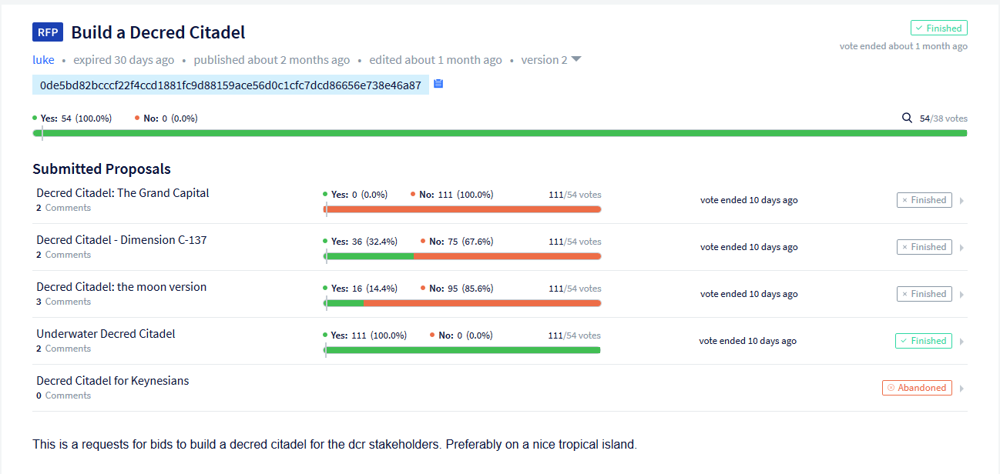

# Politeia Digest #33 - June 13 - July 19 2020

**Treasury balance: {} DCR (approx +{} DCR/month) - ${} million (+${}k/month) based on ${} DCR price**

## New proposals

**[PR by Monde Public Relations - Phase Two](https://proposals.decred.org/proposals/c81926b1958e54b2f294085da4ab03e9a63223f8ccd32e74a43493bf62de6185)**

Published 10 Jul by lindseymmc | 17 comments

This proposal requests a continuation of funding for Monde PR at $3,500/month for another year, following on from 6 months of the phase 1 [proposal](https://proposals.decred.org/proposals/bdd02d82547bd78fc95939c1e2b3df21ebec6e8d31444df5bea3c133b0199f05). The proposal includes a [link](https://github.com/decredcommunity/pr/blob/release/monde-pr-media-coverage.csv) to a csv file with all of the coverage secured during phase 1, and it is this which the discussion has focused on.

Comments are generally supportive of the effort put in by @lindseymmc, and appreciative of the reporting on the first phase. The main points raised about how phase 1 could be improved upon concern the proportion of coverage which only mentions Decred in passing, and where the stories are published. @bee detailed some analysis of the coverage in this [comment](https://proposals.decred.org/proposals/c81926b1958e54b2f294085da4ab03e9a63223f8ccd32e74a43493bf62de6185/comments/17), with 46 out of 179 items having Decred in the title, dropping to 4 items when syndicated duplicates are removed. "Put another way, out of the 34 articles mentioned, only 7 have at least 1 paragraph about Decred, and none are exclusively about it."

**[Augmented Reality posters](https://proposals.decred.org/proposals/dedf452074752d7e29304a0566643feb26d1d130596e04c613e15de113ac2d08)**

Published 16 Jul by mission | 11 comments

This proposal requests $15,000 for 10 Augmented Reality Posters, or $1,500 each. @mission and their partner provided [examples](http://www.users.pjwstk.edu.pl/~s2946/decred.pdf) of their previous AR work, and propose setting up a channel where they can receive feedback on the posters from the community.

Comments question the lack of detail about process or motivations in the proposal and the difficulty of assessing the quality of posters and whether they are worth $1,500 each.

## Approved proposals

**[Decred Bug Bounty Program: Phase 3](https://proposals.decred.org/proposals/2170df6af2cda7d048039d893cc8438b001577989441a33709820f56df7075c0)**

Published 1 Jun by degeri | edited 6 Jun | 8 comments (+0)

Final voting figures: 12,746 Yes votes, 262 No votes (98% Yes) - voter participation of 32%.

## Rejected proposals

**[Content Production for Decred in russian](https://proposals.decred.org/proposals/df11d7ac85061e6a02d6503555e585a1a37fffd82101eeea14670537c951926f)**

Published 19 Jun by ivandecredfan | edited 23 Jun | 23 comments

Final voting figures: 3,093 Yes votes, 5,624 No votes (35.5% Yes) - voter participation of 21%.

This proposal requested a budget of $1,600/month for 4 months, plus $1,600 for work already completed (so a total of $8,000) for Russian content production. This follows a similar [proposal](https://proposals.decred.org/proposals/92e3f2176b332c1aea5887acd2324c2cd730ec450e563df52ddae9d5927d5d36) from @ivandecredfan in Feb which was rejected with 21% approval. The new proposal focuses on translation of Exitus' videos into Russian, and also translation of written content. Work would be billed at a rate of $20/hr.

The proposal originally requested a budget of $2,000/month but this was reduced in response to early comments. Some comments take issue with a relatively large proposal (80 hours per month) dedicated to translating content into Russian, by a contractor who does not work on some other aspects of the project as well. The difficulty of assessing the quality of these videos without more feedback from Russian-speaking community members was also cited as an issue by several comments. Finally the low numbers of views and claps for the content @ivandecred has produced so far as taken as a negative by some commenters.

## Other News

The issue with comments made while the server is journaling (resulting in quite a few duplicated comments) received a quick fix (comments during this window are rejected) and is soon to make this a daily rather than hourly occurrence.

On Jun 8 @lukebp [tweeted](https://twitter.com/lukebp_/status/1270075883487850496?s=20) about RFP front end work from @amass being merged. That testnet RFP has now been approved, and the subsequent RFP process unfolded in which the Underwater Decred Citadel proposal won out.

## About this issue

Snapshot of Politeia data for this issue is based on this [commit]({link}).

Content for this edition was authored by richardred with fixes from {name}.

Image credit: {name}
