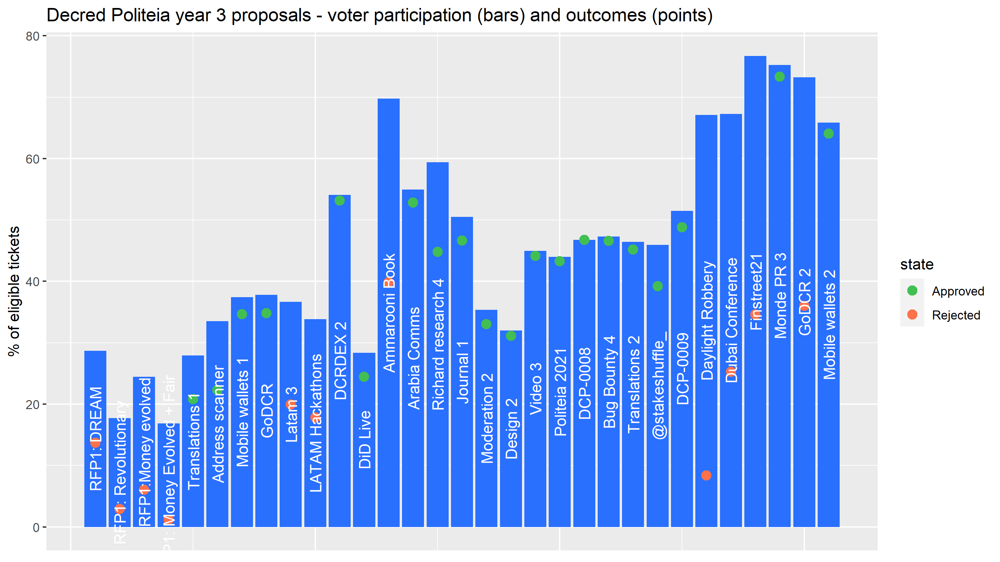

# Politeia Digest #48 - Oct 4 - Nov 1 2021

**Treasury balance: 733,772 DCR (approx +10,118 DCR/month) - $82.5 million (+$1.1M/month) based on $112.42 DCR price**

## New proposals

**[Decred Economic Education and Outreach](https://proposals.decred.org/record/c1f5b5c)**

Published Oct 25 by ammarooni | edited Nov 1 | 17 comments 

This proposal requests $12,000 for around 6 months of work producing research papers, social media posts, memes and meetups. It is a revised version of a previous [proposal](https://proposals-archive.decred.org/proposals/9e1d644) which had the same kind of content but as part of a book - this proposal was narrowly rejected with 57% Yes votes. The proposed outreach would focus on DCR as a sound money asset and Decred as a leading DAO. Primary deliverables would be 5-6 articles, secondary deliverables would be memes and social media outreach to support the primary deliverables, plus through @DecredCanada to promote a couple of meetups in the Toronto area. The proposed spending breakdown is $10,000 on research papers and $2,000 on memes and meetups.

Almost all of the comments are very positive and supportive of the proposal. The only negative comments come from @decredinator, but this one harks back to previous failed proposals about "Bitcoin Evolution" and tax documentaries - and even this one is considering a yes vote, "better than nothing I suppose".

## Approved proposals

**[Mobile Wallets (2021 - 2022)](https://proposals.decred.org/record/6db3c4e)**

Published Sep 22 by raedah | edited Oct 7 | 6 comments (+1)

Final voting figures: 26,212 Yes votes, 745 No votes (97.2% Yes) - voter participation of 66%.

*Recap: This proposal requests $72,000 for continued work on developing mobile wallets for iOS and Android, covering May 2021 to April 2022. Major achievements since the last [proposal](https://proposals-archive.decred.org/proposals/bc499c9) was approved are reflected in the v1.6 release, which includes StakeShuffle privacy, Politeia proposal viewing and notifications, and a Dark Mode for the UI. Links and changelogs and contribution graphs on GitHub are provided by way of progress report.*

The proposal was edited to add more description of the work done, such as major pull requests, before voting was authorized.

## Rejected proposals

**[GoDCR (2021 - 2022)](https://proposals.decred.org/record/f7d9fc8)**

Published Sep 22 by raedah | edited Oct 7 | 31 comments (+8)

Final voting figures: 14,741 Yes votes, 15,234 No votes (49.2% Yes) - voter participation of 73%.

*Recap: This proposal requests a budget of $200,000 for one year of continued development of GoDCR, covering May 2021 to April 2022. This represents a significant increase in monthly cost ($7,500/month to $16,600/month) and duration from the initial [proposal](https://proposals-archive.decred.org/proposals/e5c8051). The sponsorship of Gio UI is set to continue at a rate of $1,000/month, this is reported to have expedited bug fixes and supported the upstream project that GoDCR relies on. Progress on GoDCR has resulted in a preview testnet [release](https://github.com/planetdecred/godcr/releases) which can be tested.* 

The proposal was edited to add more description of the work done, such as major pull requests, before voting was authorized.

## Other News

Politeia passed the third anniversary of its launch on October 16th, and this [post](https://blockcommons.red/publication/politeia-at-3/) from @richardred has some stats and graphs about the last year, and the first three years in general. 

## About this issue

Snapshot of Politeia data for this issue is based on this [commit]({link}).

Content for this edition was authored by @richardred with fixes from {name}.

Image credit: @30000fps

