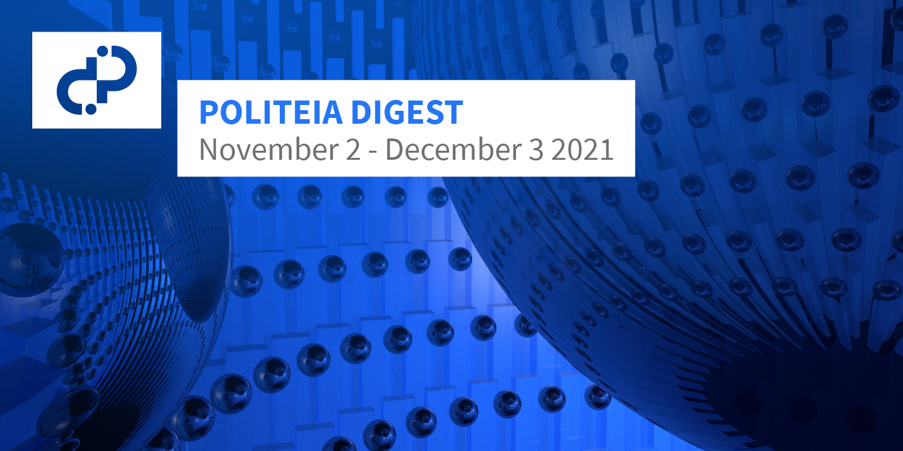

# Politeia Digest #49 - Nov 2 - Dec 3 2021

**Treasury balance: 742,662 DCR (approx +10,018 DCR/month) - $80 million (+$1.08M/month) based on $108 DCR price**

## New proposals

**[Change PoW/PoS Subsidy Split From 60/30 to 10/80](https://proposals.decred.org/record/427e1d4)**

Published Nov 26 by jy-p | 135 comments

This proposal would change the issuance of new DCR from the current proportion (60% PoW, 30% PoS, 10% Treasury) to lower the share of rewards going to PoW miners to 10%, and re-allocate those rewards to PoS voters who would then receive 80% of newly issued DCR. The rationale for the change is based on the [work of @tacorevenge](https://medium.com/@tacorevenge/the-suppressor-part-2-on-chain-analysis-6561c5a478c4) which suggests malicious dumping of mined DCR on the part of a small number of actors who control the majority of Decred's PoW hashrate. The proposal reconsiders the observed reality of Decred's PoW in relation to the theory which had informed the original distribution schedule, finding that the marketplace for Decred ASICs and hashrate is dysfunctional and such a heavy weighting towards PoW is not in the project's interests. The proposal also mentions some little known history, in that @tacotime (Decred co-founder) had originally argued for a split of 30/60/10 to PoW/PoS/Treasury. The change to consensus rules which would bring about this change is described as not technically challenging to implement and a timeframe of 2-6 weeks is given.

The proposal has stirred vigorous debate in the community, accumulating a record setting 133 comments in its first week. There are a number of comments which provide in depth calculations related to the proposal and which received a lot of upvotes on Politeia:

@buck54321 [estimated](https://proposals.decred.org/record/427e1d4/comments/52) that PoW miners have a profitability rate of 940% at the moment and could sustain a 90% cut in rewards while still being profitable with the same electricity costs - the comment argues that the change will not result in a decrease in security from PoW.

@nnnko56 has done some [calculations](https://proposals.decred.org/record/427e1d4/comments/95) about the distributional effect of the change, comparing scenarios for a new stakeholder buying their first tickets in April 2016 and a new stakeholder buying their first tickets after the change - early stakeholders have been strongly diluted by PoW rewards, but this will no longer happen after the change is implemented.

In the comments, I counted 30 different users who expressed an opinion about the proposal (16 in favor, 10 opposed, 4 undecided), and it should be noted that much of the opposition comes from unfamiliar accounts representing PoW miners. Most of the more recognisable Politeia contributors seem to support the proposal in some form, with some suggesting alternative distributions that dilute PoW rewards in different ways.

**[Decred Arabia Communications and Content 2022](https://proposals.decred.org/record/0ff082d)**

Published Nov 24 by arij | 11 comments

This proposal requests $10,600 to extend the work of the current proposal for another 10-12 months. The previous proposal had a budget of $6,200 for six months but only $2,120 was used. An overview of the last period's activities is provided, these included a limited number of events due to Covid-19 restrictions. For the coming year, the proposal projects most of the budget being spent on events, with $2,100 for producing videos.

Most of the comments are supportive of the proposal, including a warm [exchange](https://proposals.decred.org/record/0ff082d/comments/11) between @bee and @arij.

## Rejected proposals

**[Decred Economic Education and Outreach](https://proposals.decred.org/record/c1f5b5c)**

Published Oct 25 by ammarooni | edited Nov 1 | 24 comments

Final voting figures: 9,493 Yes votes, 18,765 No votes (33.6% Yes) - voter participation of 70%.

*Recap: This proposal requested $12,000 for around 6 months of work producing research papers, social media posts, memes, and meetups. It is a revised version of a previous [proposal](https://proposals.decred.org/proposals/9e1d644) which had the same kind of content but as part of a book - this proposal was narrowly rejected with 57% Yes votes. The proposed outreach would focus on DCR as a sound money asset and Decred as a leading DAO. Primary deliverables would be 5-6 articles, secondary deliverables would be memes and social media outreach to support the primary deliverables, plus through @DecredCanada to promote a couple of meetups in the Toronto area. The proposed spending breakdown is $10,000 on research papers and $2,000 on memes and meetups.*

Although the proposal was rejected, @ammarooni was encouraged to put up a donation address by some community members and then hit the [funding](https://twitter.com/Ammarooni/status/1458541211673931778) target of $12K in under 12 hours, thanks to 30 different transactions donating DCR.

## About this issue

Content for this edition was authored by @richardred with fixes from @degeri and @davecgh.

Image credit: @30000fps
