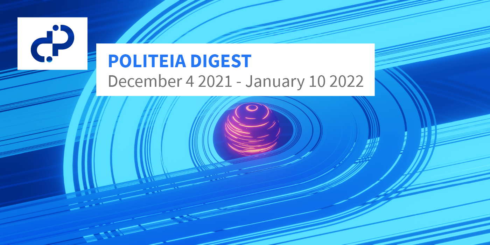

# Politeia Digest #50 - Dec 4 2021 - Jan 10 2022

**Treasury balance: 755,221 DCR (approx +9,820 DCR/month) - $40.7 million (+$530k/month) based on $53.95 DCR price**

## New proposals

**[Twitter Bot Phase 2 @StakeShuffle_](https://proposals.decred.org/record/1a290d8)**

Published Dec 30 by coinshuffle_bot | 6 comments

This proposal requests $1,684 for work done on phase 2 of the [@StakeShuffle_](https://twitter.com/StakeShuffle_) twitter bot, which regularly tweets usage stats for Decred's Stake Shuffle mixing. The proposal requests payment for work done to improve the bot for phase 2 and to cover hosting costs for 2022. This follows the same funding model as the [first](https://explorer.dcrdata.org/proposal/289575525a368103) phase, where the work was already done before payment was requested. The new features for phase 2 are based on comments from the first proposal, they are mostly new metrics to broadcast.

Comments on the proposal are supportive.

**[DCRDEX Phase 3 - Bonds, Decentralization, and Privacy](https://proposals.decred.org/record/3326c82)**

Published Jan 8 by chappjc | 6 comments

This proposal requests $370,000 for further funding of DCRDEX development, which would support the project for a further 9 months. Major achievements since the last proposal and initial release of DCRDEX include support for SPV mode for both BTC and DCR, with ETH support still requiring audit. An audit for the ETH smart contracts is one of the items which would be funded with this phase of development, along with maintenance of current product (estimated at 35% of effort) and development of a range of new features. The main features to be developed include fidelity bonds (an alternative to paying the server operator a registration fee), support for mixed accounts and accelerating BTC swap transactions. The proposal also budgets 20% for future planning and prototyping, with subjects including mesh architecture and a Lightning Network market.

Comments on the proposal are very supportive.

## Approved proposals

**[Change PoW/PoS Subsidy Split From 60/30 to 10/80](https://proposals.decred.org/record/427e1d4)**

Published Nov 26 by jy-p | 166 comments (+31)

*Recap: This proposal would change the issuance of new DCR from the current proportion (60% PoW, 30% PoS, 10% Treasury) to lower the share of rewards going to PoW miners to 10%, and re-allocate those rewards to PoS voters who would then receive 80% of newly issued DCR. The rationale for the change is based on the [work of @tacorevenge](https://medium.com/@tacorevenge/the-suppressor-part-2-on-chain-analysis-6561c5a478c4) which suggests malicious dumping of mined DCR on the part of a small number of actors who control the majority of Decred's PoW hashrate. The proposal reconsiders the observed reality of Decred's PoW in relation to the theory which had informed the original distribution schedule, finding that the marketplace for Decred ASICs and hashrate is dysfunctional and such a heavy weighting towards PoW is not in the project's interests. The proposal also mentions some little known history, in that @tacotime (Decred co-founder) had originally argued for a split of 30/60/10 to PoW/PoS/Treasury. The change to consensus rules which would bring about this change is described as not technically challenging to implement and a timeframe of 2-6 weeks is given.*

**[Decred Arabia Communications and Content 2022](https://proposals.decred.org/record/0ff082d)**

Published Nov 24 by arij | 11 comments 

*Recap: This proposal requests $10,600 to extend the work of the current proposal for another 10-12 months. The previous proposal had a budget of $6,200 for six months but only $2,120 was used. An overview of the last period's activities is provided, these included a limited number of events due to Covid-19 restrictions. For the coming year, the proposal projects most of the budget being spent on events, with $2,100 for producing videos.*

## About this issue

Content for this edition was authored by @richardred with fixes from @bee, @degeri and @davecgh.

Image credit: @30000fps
